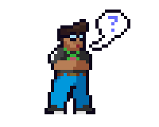
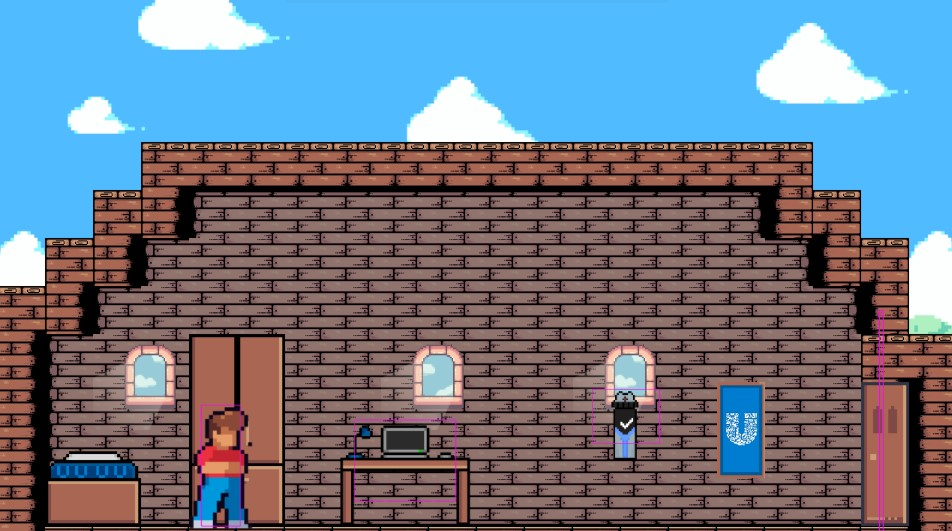
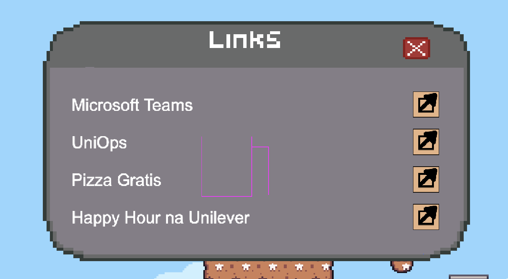
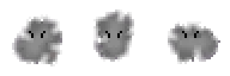
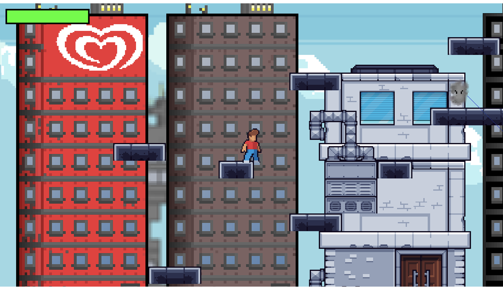

# GDD - Game Design Document - Módulo 1 - Inteli


## Preserverance Games

<a href="https://www.linkedin.com/in/david-deodato-41b9b72b7/">David Deodato Alvarenga da Silva</a>, <a href="https://www.linkedin.com/in/igor-sampaio-silva/">Igor Sampaio Silva</a>, <a href="https://www.linkedin.com/in/marlos-do-carmo-guedes-366987250/">Marlos do Carmo Guedes</a>, <a href="https://www.linkedin.com/in/otavio-vasconcelos-a11827208/">Otávio de Carvalho Vasconcelos</a>, <a href="https://www.linkedin.com/in/raphaelfelipesilva/">Raphael Felipe da Silva</a>, <a href="https://www.linkedin.com/in/victorbarq/">Ricardo de Toledo Planas</a> e <a href="https://www.linkedin.com/in/thiago-volcati-a42a94208/">Thiago Martins Volcati de Almeida</a>

<div align="center">
<sub>Figura 01 - Preserverance Games</sub>

<sup>Fonte: Material produzido pelos autores (2024)</sup>
</div>

## Sumário

Lista de figuras:

Numeração | Figura
--- | ---
01 | Preserverance Games
02 | Análise SWOT
03 | Proposta de Valor
04 | Matriz de Riscos
05 | Npc hub
06 | Npc diretora
07 | Seleção De Jogador Imagem
08 | Ilustração do ambiente Quarto
09 | Ilustração do Mundo Lúdico
10 | Ilustração NPC do Hub de Links
11 | Ilustração do Hub de Links
12 | Arte Conceitual da Cena 2
13 | Arte Conceitual da Cena 3
14 | Arte Conceitual da Cena 4
15 | Diagrama de Cenas
16 | Fase Inicial - Mundo Lúdico
17 | Fase Inicial - Interação com NPC
18 | Tela de Início
19 | Seleção de Personagem
20 | Fase 1 - Quarto
21 | Fase 1 - Interação com NPC dentro do Quarto
22 | Fase 2 - Mundo Lúdico
23 | Fase 1 - Interação com NPC dentro do quarto
24 | Página do título - Apresentação inicial do game
25 | Inclusão e Diversidade - Player select
26 | Imagem do tutorial - Primeira cena de interação com o usuário
27 | Imagem do Teams - player recebendo a missão
28 | Inclusão e Diversidade - Player select
29 | Inimigo - Fumaça
30 | Ilustração da Title Screen
31 | Ilustração da seleção de personagem
32 | Ilustração do Tutorial
33 | Ilustração do ambiente Quarto
34 | Ilustração do affordance
35 | Ilustração da Interação com o computador
36 | Ilustração do Chefão - Level 2
37 | Ilustração do Tutorial de combate
38 | Ilustração do Level 2
39 | Ilustração do NPC do hub de links/checkpoint
40 | Ilustração do hub de links
41 | Ilustração do Tutorial
42 | Ilustração do Power-up
43 | Ilustração do Level 3
44 | Ilustração do Chefão - Level 3
45 | Ilustraçao do Tutorial de avanço rápido
46 | Ilustração do Level 4
47 | Tela de título - Inglês
48 | Tela de título - Português
49 | Arquivos de texto
50 | Personagens com os power-ups
51 | Hub de links - 0 clicks
52 | Hub de links - 2 clicks

Lista de tabelas:
Numeração | Tabela
--- | ---
01 | Requisitos do Projeto
02 | Trilha sonora
03 | Inventário
04 | Bestiário
05 | Casos de Teste
06 | Teste 1
07 | Teste 2
08 | Teste 3
09 | Teste 4
10 | Teste 5
11 | Observações do Teste 1
12 | Melhorias do Teste 1
13 | Observações do Teste 2
14 | Melhorias do Teste 2
15 | Observações do Teste 3
16 | Melhorias do Teste 3
17 | Observações do Teste 4
18 | Melhorias do Teste 4
19 | Observações do Teste 5
20 | Melhorias do Teste 5

[1. Introdução](#c1)

[2. Visão Geral do Jogo](#c2)

[3. Game Design](#c3)

[4. Desenvolvimento do jogo](#c4)

[5. Casos de Teste](#c5)

[6. Conclusões e trabalhos futuros](#c6)

[7. Referências](#c7)

[Anexos](#c8)

<br>


# <a name="c1"></a>1. Introdução

&nbsp;&nbsp;&nbsp;&nbsp;Este documento delineia a proposta de desenvolvimento de um jogo destinado a aprimorar e gamificar o processo de onboarding na Unilever. O objetivo é transformar a integração de novos colaboradores numa experiência mais envolvente e informativa, utilizando elementos de jogo para facilitar a aprendizagem e a absorção de informações essenciais sobre a empresa. A introdução abrange o escopo do projeto, oferecendo uma visão detalhada sobre o contexto da indústria, a análise SWOT realizada para a Unilever, a descrição da solução desenvolvida, a proposta de valor, os riscos associados e uma aplicação das 5 Forças de Porter para entender melhor o ambiente competitivo no qual a Unilever opera.

## 1.1. Escopo do Projeto

&nbsp;&nbsp;&nbsp;&nbsp;O escopo do projeto é detalhadamente descrito através de uma série de subseções, que incluem uma visão sobre o contexto da indústria de bens de consumo, onde a Unilever se posiciona como líder global. Uma análise SWOT é apresentada, destacando forças, fraquezas, oportunidades e ameaças específicas à Unilever. A solução proposta visa gamificar o processo de onboarding, tornando-o mais interativo e engajante para os novos colaboradores, com uma descrição detalhada da solução desenvolvida, a proposta de valor, uma matriz de riscos identificada pela equipe de desenvolvimento e uma análise das 5 Forças de Porter para compreender os desafios e oportunidades no mercado.

### 1.1.1. Contexto da indústria

&nbsp;&nbsp;&nbsp;&nbsp;A Unilever, gigante multinacional no segmento de bens de consumo, registra uma presença marcante na economia global, com suas mais de 400 marcas alcançando consumidores em mais de 190 países e gerando um volume de negócios que se expressa em bilhões de dólares anualmente. Essa contribuição substancial ao PIB global destaca seu papel influente no mercado internacional. Com vertentes diversificadas que incluem alimentação, limpeza, higiene pessoal e cuidados pessoais, a empresa se orgulha de marcas icônicas como Omo, Dove, Doriana, Kibon, Hellmann's, Rexona, Knorr-Cica, Lipton, Magnum e Comfort.

Em meio a este sucesso, a Unilever não está isenta de desafios. A empresa enfrenta a intensa competição de outras corporações multinacionais como a Procter & Gamble e a Nestlé. Dentre os obstáculos, incluem-se a necessidade de se adaptar às flutuações econômicas globais, a demanda por práticas sustentáveis e a pressão constante por inovação frente a consumidores que buscam novidades e responsabilidade socioambiental. Além disso, o impacto da digitalização nas estratégias de marketing e vendas, bem como nas expectativas dos consumidores, são desafios contínuos que a Unilever precisa gerenciar para manter sua posição de liderança e continuar a expandir seu impacto econômico.

### 1.1.2. Análise SWOT

&nbsp;&nbsp;&nbsp;&nbsp;A análise SWOT é relacionada ao parceiro Unilever, a tabela foi feita a fim de realizar uma avaliação ambiental no âmbito estratégico, levando em consideração o contexto da indústria, ocorrências e as características do ambiente interno e externo da Unilever.

<div align="center">
<sub>Figura 02 - Análise SWOT</sub>

<sup>Fonte: Material produzido pelos autores (2024)</sup>
</div>

&nbsp;&nbsp;&nbsp;&nbsp;A matriz SWOT da Unilever revela uma empresa que se beneficia de uma posição forte e confiável no mercado global, apoiada por um portfólio de marcas multinacionais renomadas e um compromisso com a sustentabilidade e responsabilidade social. Essas forças servem não só para reforçar a reputação da Unilever, mas também para criar uma base sólida para iniciativas futuras e manter a lealdade do consumidor.

&nbsp;&nbsp;&nbsp;&nbsp;No entanto, a empresa enfrenta desafios significativos. A concorrência intensa, especialmente de empresas especializadas em seus setores, como a Nestlé e a Johnson & Johnson, exige uma constante inovação e adaptação. Além disso, a complexidade organizacional decorrente da diversidade de setores atendidos pode gerar dificuldades internas, o que exige uma gestão ágil e adaptável.

&nbsp;&nbsp;&nbsp;&nbsp;Em termos de oportunidades, a Unilever está bem posicionada para se beneficiar do crescimento tecnológico na automação de processos e onboarding de funcionários, assim como tem capacidade de investimento para expandir em mercados emergentes de bens de consumo, que são essenciais para o crescimento contínuo da empresa.

&nbsp;&nbsp;&nbsp;&nbsp;Por outro lado, ameaças externas, como a volatilidade dos preços das matérias-primas e os riscos associados à reputação devido ao tamanho e visibilidade da empresa, podem impactar negativamente a Unilever a qualquer momento. Assim, é essencial que a empresa continue a monitorar essas ameaças e desenvolva estratégias proativas para mitigar possíveis impactos.

&nbsp;&nbsp;&nbsp;&nbsp;A análise SWOT enfatiza a necessidade de a Unilever continuar a alavancar suas forças enquanto aborda suas fraquezas e capitaliza as oportunidades disponíveis, sempre consciente das ameaças que podem afetar sua operação e seu status no mercado.


### 1.1.3. Descrição da Solução Desenvolvida

&nbsp;&nbsp;&nbsp;&nbsp;A Unilever, apesar de sua posição como empresa líder global, identificou defasagens em seu processo de *onboarding*, notada na baixa absorção de informações críticas pelos novos colaboradores. A proposta de solução almeja reformular e gamificar o *onboarding*, incorporando elementos lúdicos para tornar a aprendizagem envolvente e significativa.
A solução proposta será utilizada como uma ferramenta interativa e dinâmica, apresentando-se na forma de um jogo personalizado destinado a envolver ativamente os novos membros da empresa. Os benefícios almejados incluem aumento na retenção de informações, uma compreensão mais profunda da empresa e um alinhamento eficaz com os valores e objetivos da Unilever. O critério de sucesso será medido através de análises periódicas de desempenho, satisfação e engajamento, visando proporcionar uma transição positiva para o ambiente de trabalho da Unilever.

### 1.1.4. Proposta de Valor

&nbsp;&nbsp;&nbsp;&nbsp;A proposta de valor descreve aspectos essenciais para criação de valor para o projeto, traçando o objetivo de melhor entender a realidade do parceiro e entregar uma solução alinhada com o que a Unilever espera.

<div align="center">
<sub>Figura 03 - Proposta de Valor</sub>

<sup>Fonte: Material produzido pelos autores (2024)</sup>
</div>

&nbsp;&nbsp;&nbsp;&nbsp; **Na seção "Proposta de Valor", há três componentes principais destacados na figura, que buscam trazer o papel da corporação no modelo de negócios.**

&nbsp;&nbsp;&nbsp;&nbsp; *1. Produtos e Serviços:* Apresenta a ideia de "*Onboarding* Gamificado", sugerindo um processo de integração que usa elementos de jogos.

&nbsp;&nbsp;&nbsp;&nbsp; *2. Criadores de Ganho:* Detalha como o *onboarding* gamificado pode ajudar a compreender a estrutura organizacional, canais de suporte e o Dicionário Unilever. Este ponto esta direcionado a facilitar a adaptação dos novos colaboradores e tornar o aprendizado sobre a empresa mais divertido e atraente.

&nbsp;&nbsp;&nbsp;&nbsp; *3. Aliviadores de Dor:* Enfatiza a importância de tornar a aprendizagem empresarial divertida e atraente para aliviar a dificuldade dos novos colaboradores em absorver informações extensas.

&nbsp;&nbsp;&nbsp;&nbsp; **Na seção "Segmentos de Clientes", também existem três componentes principais destacados na figura, que buscam trazer o papel do cliente no modelo de negócios.**

&nbsp;&nbsp;&nbsp;&nbsp; *1. Trabalhos do Cliente:* Fala sobre a necessidade de promover a cultura empresarial e tornar o *onboarding* mais engajado e moderno.

&nbsp;&nbsp;&nbsp;&nbsp; *2. Ganhos:* Destaca a busca por mais eficiência.

&nbsp;&nbsp;&nbsp;&nbsp; *3. Dores:* Menciona como o *onboarding* monótono e desinteressante pode ser um obstáculo, possivelmente levando a uma dificuldade dos novos colaboradores em absorver informações.

### 1.1.5. Matriz de Riscos


&nbsp;&nbsp;&nbsp;&nbsp;A matriz de risco demonstra os riscos observados no projeto pela equipe de desenvolvimento, representando ameaças e oportunidades, assim como impactos relevantes sobre o projeto. Em verde, estão indicados percalços que não necessitam de intervenção; em amarelo, pontos que apresentam média probabilidade e demandam certa atenção; e, em vermelho, estão destacados pontos críticos que devem ser evitados.

<div align="center">
<sub>Figura 04 - Matriz de Riscos</sub>

<sup>Fonte: Material produzido pelos autores (2024)</sup>
</div>


&nbsp;&nbsp;&nbsp;&nbsp;A matriz de risco fornece uma visão estratégica crucial para o gerenciamento de riscos, enfatizando a importância de antecipar e mitigar problemas que possam surgir. Riscos como as divergências criativas e a dificuldade em cumprir prazos, por exemplo, destacam a necessidade de processos de desenvolvimento ágeis e adaptativos. Esta matriz é essencial para assegurar que a equipe se mantenha alinhada e o projeto progrida de forma eficiente e eficaz. Nessa perspetiva, o grupo elaborou planos de ação para cada um dos riscos levantados:

*1. Eventuais Bugs:* Implementar testes automatizados contínuos e revisões de código para identificar e corrigir bugs precocemente.

*2. Problemas de Comunicação:* Estabelecer canais de comunicação claros e reuniões regulares de alinhamento entre as equipes.

*3. Não finalizar o projeto no prazo:* Criar um cronograma realista com marcos bem definidos e revisões periódicas do progresso.

*4. Jogo ficar grande demais:* Definir um escopo de projeto claro e aplicar a metodologia de desenvolvimento ágil para adaptar mudanças.

*5. Divergências criativas nas implementações:* Promover workshops de alinhamento criativo e ter um documento de visão do projeto para referência.

*6. Dificuldade em continuar as etapas do projeto:* Designar um gerente de projeto para monitorar o progresso e resolver bloqueios.

*7. O jogo conter erros:* Estabelecer uma fase de Quality Assurance (QA) rigorosa antes do lançamento.

*8. Não conseguirmos entregar o projeto:* Ter um plano B de escopo reduzido pronto para implementação em caso de atrasos críticos.

*9. Deixarmos algum bug escapar na varredura/testes:* Implementar uma fase de beta testing com usuários externos para detecção de bugs residuais.

*10. Escopo mal Definido:* Trabalhar com o cliente para definir e documentar claramente os requisitos e o escopo do projeto.

*11. Tangenciar a proposta pedida pelo cliente:* Manter revisões de alinhamento frequentes com o cliente para garantir que as entregas atendam às expectativas.

*12. Projeto Incompleto:* Garantir que cada entrega tenha critérios de aceitação bem definidos e revisões de progresso com o cliente.

*13. Incompatibilidade e Falhas de Performance em Plataformas Diversificadas:* Realizar testes de compatibilidade e desempenho em todas as plataformas-alvo.

*14. Plágio não intencional:* Realizar checagens de originalidade e ter políticas claras de direitos autorais e referências.

*15. Perda ou corrupção de dados do jogo:* Implementar backups regulares e estratégias de recuperação de desastres.

*16. Ausência de Membro(s) na equipe:* Desenvolver um plano de contingência para redistribuição de tarefas e contratação de recursos temporários se necessário.

### 1.1.6. 5 Forças de Porter

#### Obstáculos para novos entrantes:
&nbsp;&nbsp;&nbsp;&nbsp;A indústria na qual a Unilever opera apresenta barreiras significativas à entrada, incluindo altos custos de capital para produção e distribuição, exigências regulatórias estritas, e a necessidade de estabelecer uma forte marca e rede de distribuição. A Unilever beneficia-se de economias de escala e de um portfólio de marcas bem estabelecido que são reconhecidas e confiáveis pelos consumidores.

#### Impacto dos novos entrantes: 
&nbsp;&nbsp;&nbsp;&nbsp;Embora haja barreiras significativas, o surgimento de novos entrantes focados em nichos de mercado ou inovações, especialmente no segmento de produtos orgânicos e sustentáveis, pode desafiar a posição da Unilever. Contudo, o impacto potencial é moderado devido à forte presença de mercado e capacidade de inovação da Unilever.

#### Produtos ou serviços substitutos relevantes: 
&nbsp;&nbsp;&nbsp;&nbsp;Existem diversos produtos substitutos nos segmentos em que a Unilever atua, desde marcas locais até alternativas orgânicas e naturais. A tendência crescente de conscientização sobre saúde e sustentabilidade tem impulsionado a procura por esses substitutos.

#### Nível de ameaça dos substitutos: 
&nbsp;&nbsp;&nbsp;&nbsp;A ameaça é considerável, especialmente com a crescente preocupação dos consumidores com a sustentabilidade e ingredientes naturais. A Unilever tem respondido por meio do desenvolvimento de produtos mais sustentáveis e através de aquisições estratégicas de marcas neste segmento.

#### Principais fornecedores da indústria:

&nbsp;&nbsp;&nbsp;&nbsp;A Unilever lida com uma ampla gama de fornecedores, incluindo produtores de matérias-primas, embalagens, e serviços de logística.

#### Poder de barganha dos fornecedores:

&nbsp;&nbsp;&nbsp;&nbsp; O poder de barganha dos fornecedores é moderado. A Unilever, devido ao seu tamanho e volume de compras, consegue exercer uma negociação favorável em muitos casos. No entanto, para ingredientes específicos ou tecnologias patenteadas, os fornecedores podem ter maior poder de barganha.

#### Principais tipos de clientes da indústria:

&nbsp;&nbsp;&nbsp;&nbsp; Os clientes da Unilever variam desde grandes varejistas e supermercados até consumidores individuais.

#### Poder de barganha dos clientes:

&nbsp;&nbsp;&nbsp;&nbsp; O poder de barganha dos clientes é significativo, especialmente dos grandes varejistas que podem negociar preços melhores devido ao volume de compra. Os consumidores individuais têm poder limitado, mas influenciam a empresa através das preferências de consumo e tendências.

#### Principais concorrentes na indústria:

&nbsp;&nbsp;&nbsp;&nbsp; A Unilever compete com outras multinacionais como Procter & Gamble, Nestlé, e L'Oréal, além de diversas empresas locais e regionais.

#### Nível de rivalidade:

&nbsp;&nbsp;&nbsp;&nbsp;A rivalidade na indústria é alta, com competição intensa em inovação, marketing, e expansão para novos mercados. A Unilever mantém sua competitividade através de inovação constante, diversificação de produtos, e sustentabilidade como parte de sua estratégia de negócios.

## 1.2. Requisitos do Projeto

&nbsp;&nbsp;&nbsp;&nbsp;Após um longo processo criativo, que abrangesse os interesses do grupo, da Unilever e a viabilidade de implementação das mecânicas e idéias discutidas, o grupo impôs alguns requisitos para produção da solução gamificada que não fugisse da premissa original.
<div align="center">
<sub>Tabela 01 - Requisitos do Projeto</sub>
</div>

\# | Requisito
--- | ---
1 | Recompensas por responder perguntas relacionadas à Unilever
2 | Os controles serão: seta cima, esquerda, baixo, direita, Q W e E
3 | HUB de direcionamento para trilhas específicas de Onboarding da Unilever
4 | Apresentação de informações públicas da empresa de forma gamificada
5 | O jogo será em 2D de plataforma
6 | Apresentação das mecânicas do Onboarding
7 | Mostrar o dicionário da Unilever
8 | O personagem perde uma vida toda vez que toca em um inimigo ou em algum projétil inimigo
9 | Mecânica de utilização de poderes
10 | Mundo lúdico - estilo Mario
11 | Realização de quiz
12 | Contato com plataformas Unilever (Uniops & degreed)
13 | Mecânica de avanço rápido
<div align="center">
<sup>Fonte: Material produzido pelos autores (2024)</sup>
</div>

&nbsp;&nbsp;&nbsp;&nbsp;Com a conclusão do desenvolvimento da solução gamificada, avaliamos que os requisitos estabelecidos foram atendidos, resultando em uma experiência que reflete os valores e práticas da Unilever. Ao longo do processo, cada elemento, desde as mecânicas intuitivas de controle até o envolvente mundo lúdico, foi meticulosamente desenhado para engajar os novos colaboradores de maneira eficaz e agradável. Após reflexão e consideração do conteúdo já incorporado no jogo, a equipe decidiu que a inclusão de uma mecânica específica para o dicionário da Unilever não era mais essencial para o escopo do projeto. Todas as decisões relacionadas a implementação dos requisitos foi pensando em um produto final que não só atenda, mas supere as expectativas dos usuários, proporcionando uma experiência de aprendizado completa e envolvente sem sobrecarregar o processo com elementos redundantes. Continuaremos, no entanto, a monitorar o feedback dos jogadores e a avaliar oportunidades para futuras melhorias e adições ao jogo.

&nbsp;&nbsp;&nbsp;&nbsp;


## 1.3. Público-alvo do Projeto

&nbsp;&nbsp;&nbsp;&nbsp;O público-alvo de um produto é um fator crucial no momento de desenvolver algo como um jogo. O grupo fez uma pesquisa de público-alvo, filtrando pessoas recém-contratadas pela Unilever como estágiarias e trainees, que gerou um dado cujo maioria das pessoas estão na faixa etária média de 24 anos, formadas ou ainda na formação acadêmica conectada à área de tecnologia.
Em outro momento, foi realizado um reunião com alguns funcionários recém-contratados, na qual o grupo pode veriricar que existem pessoas de outras faixa-etárias e gostos que não tinham sido identificadas na pesquisa de público-alvo. 
Portanto, após fazer correções no jogo, no intuito de torna-lo adaptável para diferentes pessoas, o público-alvo se resume em pessoas recém contratadas pela Unilever, de qualquer faixa etária, gostos e formações.

# <a name="c2"></a>2. Visão Geral do Jogo

&nbsp;&nbsp;&nbsp;&nbsp;Ao longo da leitura você será introduzido a diversos pontos principaos do jogo, incluindo os objetivos principais que os jogadores devem alcançar para progredir e completar o jogo. Além disso, discute características fundamentais que definem a experiência do jogo, como seu gênero, a plataforma na qual será jogado, o formato de jogo individual para enfatizar o desenvolvimento pessoal dos colaboradores, bem como os títulos que serviram de inspiração para a sua criação. Este capítulo também aborda o tempo estimado necessário para concluir o jogo, fornecendo assim uma compreensão abrangente tanto da estrutura quanto do conteúdo do jogo, garantindo que os jogadores tenham clareza sobre o que esperar e como navegar pelo universo do jogo.

## 2.1. Objetivos do Jogo

&nbsp;&nbsp;&nbsp;&nbsp;O jogador precisa derrotar inimigos pelo mapa, concluir trilhas de treinamento da Unilever, os quizzes e derrotar o chefão da fase, nas duas cenas de combate. Desse modo, o jogador será capaz de concluir o jogo integralmente. Conforme solicitado, nenhuma das partes anteriormente citadas (exceto trilhas obrigatórias e quizzes) será uma barreira para o colaborador completar o processo de integração.

## 2.2. Características do Jogo

 &nbsp;&nbsp;&nbsp;&nbsp;As características do jogo, são elementos fundamentais na definição da experiência geral do usuário. Estas características são classificadas em várias categorias, incluindo o gênero do jogo, a plataforma em que é jogado, o número de jogadores que suporta, as inspirações por trás de sua criação e o tempo estimado necessário para completá-lo. Cada uma dessas categorias desempenha um papel crucial na modelagem da jogabilidade e na interação do jogador com o jogo, determinando assim a forma como os jogadores irão perceber e interagir com o ambiente do jogo. Este segmento visa fornecer uma compreensão clara de como o jogo é estruturado e o que os jogadores podem esperar ao embarcar nesta aventura.

### 2.2.1. Gênero do Jogo

&nbsp;&nbsp;&nbsp;&nbsp;O gênero do jogo é de plataforma e aventura. O gênero de plataforma consiste em movimentar seu personagem através do ambiente no qual o jogo acontece. Os jogos do gênero de aventura, por sua vez, são jogos nos quais o jogador assume o lugar de protagonista e tem como objetivo explorar o ambiente interativamente e concluir quebra-cabeças.

### 2.2.2. Plataforma do Jogo

&nbsp;&nbsp;&nbsp;&nbsp;O jogo é feito para *desktop* e será jogado na plataforma *web*. Como indicado pelo termo de abertura do projeto e reafirmado pelos parceiros durante as *sprints*, a opção pela plataforma *web* *desktop* está mais alinhada com a proposta e objetivos definidos para o projeto.

### 2.2.3. Número de jogadores

&nbsp;&nbsp;&nbsp;&nbsp;Devido a indicação do parceiro e, as limitações provenientes das escolhas pela plataforma *web* e sem ligação com os servidores da empresa, o jogo será individual, por buscando salientar o desenvolvimento individual de cada colaborador.

### 2.2.4. Títulos semelhantes e inspirações

&nbsp;&nbsp;&nbsp;&nbsp;Entre as inspirações para o jogo, pode-se listar Sonic, Mario e Mega Man. As escolhas decorrem do fato de que os jogos citados pertencem aos mesmos gêneros do jogo criado, tendo como base a movimentação em duas dimensões, arte em *pixel* e a temática de aventura. Além disso, os jogos em questão revolucionaram suas época ao trazer inovação, originalidade, simplicidade e valores igualmente desenvolvidos neste projeto.

### 2.2.5. Tempo estimado de jogo

&nbsp;&nbsp;&nbsp;&nbsp;O jogo conta com 3 fases principais, nas quais o tempo médio para finalização é 5 minutos, comprovado pelos testes realizados com colaboradores da Unilever, amigos pessoais dos membros do grupo e orientadores do projeto.

# <a name="c3"></a>3. Game Design

&nbsp;&nbsp;&nbsp;&nbsp;Para um bom engajamento com o público alvo e um nível técnico elevado, o jogo foi projetado com antecedência e seus principais pontos de game design foram desenhados com minuciosidade e precisão, desde o enredo, até o personagens incluídos, cenários utilizados, diagramas de cenas e outras questões oriundas dessas.

## 3.1. Enredo do Jogo

&nbsp;&nbsp;&nbsp;&nbsp;Você acorda, está se preparando para o primeiro dia na Unilever, mas nota algo diferente, o mundo no qual a harmonia é mantida pela energia vital da natureza balanceada pela Unilever está sendo abalado, pois as principais marcas foram roubadas por vilões tenebrosos. Agora, você precisará batalhar com eles para recuperar as principais marcas e restaurar o equílibro. Os vilões por trás disso tudo são o "Rei do Desmatamento" e o "Rei da Poluição". Estes vilões, acompanhados por seus monstros, espalham o caos, sujeira e a destruição, poluindo e destruindo a natureza e ameaçando a vida de todas as criaturas que habitam esse mundo, incluindo a você. E agora,devolva as marcas para a Unilver!


&nbsp;&nbsp;&nbsp;&nbsp;Cena 0 - Tela de Título
Descrição: Tela simples de título com botão *play*, idioma atual e som.

&nbsp;&nbsp;&nbsp;&nbsp;Cena 1 - Seletor de personagem

&nbsp;&nbsp;&nbsp;&nbsp;Tela simples para que o jogador selecione seu personagem com o mouse.

&nbsp;&nbsp;&nbsp;&nbsp;Cena 2 - Tutorial dos Comandos básicos

&nbsp;&nbsp;&nbsp;&nbsp;Tela simples para que o jogador seja introduzido aos comandos básicos do jogo, como movimentação, interação e pulos.

&nbsp;&nbsp;&nbsp;&nbsp;Cena 3 - Quarto

&nbsp;&nbsp;&nbsp;&nbsp; Descrição: Quarto do personagem com um computador e um Rexona (*Power-up*) interativo.

&nbsp;&nbsp;&nbsp;&nbsp;O personagem irá acordar em seu aconchegante quarto, tendo como objetivo interagir com o computador. No dispositivo, ele será instroduzido a experiência de uso do Microsoft Teams, onde sua diretora o dará a missão de recuperar as marcas e lhe dará uma das marcas que sobraram para ajudá-lo em sua caminhada.


&nbsp;&nbsp;&nbsp;&nbsp;Fala da diretora:

'Olá, colaborador, seja bem vindo a Unilever!',

'Aqui na Unilever utilizamos o Microsoft Teams como principal forma de comunicação remota.'

'Vilões tenebrosos roubaram algumas de nossas marcas, e por conta disso, não estamos mais conseguindo manter o equilíbrio da Unilever.'

'Iremos te enviar uma das nossas marcas para você conseguir enfrentar os desafios a frente sem nem suar'

'Contamos com você, herói, ajude-nos a recuperar nossas marcas e reestruturar a empresa'

&nbsp;&nbsp;&nbsp;&nbsp;Em seguida, o personagem seguirá pela cena e deverá interagir com o Rexona.

&nbsp;&nbsp;&nbsp;&nbsp;Iniciará o o primeiro quiz do jogo, somente para aprendizado do funcionamento do quiz e validação dos comandos, feitos com o mouse.

&nbsp;&nbsp;&nbsp;&nbsp;Cena 4 - Cenário combate 1

&nbsp;&nbsp;&nbsp;&nbsp;O personagem sai do quarto e se depara com um mundo lúdico ao estilo Super Mario. Para avançar na fase, ele deve seguir para direita e derrotar os inimigos com o poder do Rexona. Ao longo da fase, estarão espalhados 2 NPCs que são obrigatórios para prosseguir na fase. Quando o jogador interagir com eles, terá acesso aos *links* disponibilizados pela Unilever, e só poderá prosseguir no jogo após clicar nos *links* oferecidos pelos NPCs e responder os quizzes corretamente.

&nbsp;&nbsp;&nbsp;&nbsp;Perto do fim da fase, haverá um *checkpoint* junto a um hub de *links* (representado por um NPC), que vai disponibilizar as trilhas Unilever, a fim de que o colaborador aprenda as principais ferramentas utilizadas dentro da empresa. Depois disso, ele poderá prosseguir na fase e enfrentar o *boss* “Rei da poluição”. Caso ele perca para o rei, irá renascer no *checkpoint* e vai pode enfrentar novamente quantas vezes forem necessárias para vencê-lo. O dano desferido é acumulado, garantindo que o colaborador consiga derrotá-lo. Após vencer o *boss*, ele soltará um item “Omo” e, ao interagir com o item, o jogador deverá responder um quiz sobre o conteúdo estudado nas trilhas. Caso ele acerte todas as questões, obterá o *Power-up* e receberá a transformação de “Super Omo”, assim podendo avançar para a próxima fase. Porém, caso não consiga concluir o questionário, ele deve realizar o quiz novamente, até que obtenha êxito.

&nbsp;&nbsp;&nbsp;&nbsp;Para finalizar a fase, o jogador deverá prosseguir até o ônibus que vai levar ele até o próximo mapa.

&nbsp;&nbsp;&nbsp;&nbsp;Cena 5 - Exploração urbana combate 2

&nbsp;&nbsp;&nbsp;&nbsp;Agora o personagem se encotra em um cenário urbano. Para avançar na fase, ele deve seguir para direita e derrotar os inimigos, agora mais poderosos. Perto do final da fase, terá novamente um *hub* de links (representado por um NPC), que disponibilizará links com outros materiais da Unilever, onde o jogador aprenderá mais conteúdos providos pela Unilever, obrigatórios para prosseguir na fase. Essa plataforma em que o NPC está vai ser um *checkpoint*, assim como no nível anterior.

&nbsp;&nbsp;&nbsp;&nbsp;No fim da fase, o jogador vai enfrentar o *boss* “Rei da Poluição”. Caso ele perca, irá retornar ao *checkpoint* e enfrentará novamente o *boss*, quantas vezes forem necessárias e também com dano cumulativo. Quando o jogador suceder, o rei deverá soltar o item “Kibon”, que ao ser coletado transformará o jogador no “Super Kibon”, adicionando o *dash*/avanço rápido, uma nova mecânica de movimentação do jogador. Para coletar esse item, o colaborador deve responder um quiz com perguntas sobre os conteúdos. Se ele não conseguir, deverá completar o quiz novamente, até o faça.

&nbsp;&nbsp;&nbsp;&nbsp;Cena 6 - Dentro da Unilever

&nbsp;&nbsp;&nbsp;&nbsp;O personagem se encontra agora na Unilever. Assim como nas outras fases, ele deve seguir para direita e, com o *power-up* da Kibon, o personagem deve utilizar o *dash*/avanço rápido para se movimentar, permitindo que ele alcance as plataformas mais distantes. Ao longo da fase, não há NPCs, a fim de instigar dúvidas no jogador, asism como não existem pontos de interação pelo mapa.

&nbsp;&nbsp;&nbsp;&nbsp;No fim da fase, o jogador encontrará a diretora. Ao conversar com o NPC se iniciará o seguinte diálogo:

&nbsp;&nbsp;&nbsp;&nbsp;Fala da Diretora:

'Incrível, você conseguiu, herói! Bem-vindo à Unilever!',

'Graças a sua coragem e determinação, todas as nossas marcas foram recuperadas.',

'Você não apenas restaurou o equilíbrio da Unilever, mas também reforçou nossa união e resiliência como equipe.',

'Seu feito vai além de apenas recuperar as marcas; você inspirou a todos nós a sermos melhores e mais fortes juntos.',

'Em nome de toda a equipe Unilever, eu gostaria de expressar nossa mais profunda gratidão. Você é um verdadeiro herói para nós.',

'Vamos continuar a comunicar e colaborar pelo Microsoft Teams. Quem sabe que novas aventuras nos aguardam?',

'Por agora, celebre, herói! Você mais do que merece. Estamos ansiosos para vê-lo brilhar ainda mais no futuro.'

&nbsp;&nbsp;&nbsp;&nbsp;A fase e o jogo se encerram com o recebimento de uma tela de congratulações ao jogador pelo seu empenho e conquistas.

## 3.2. Personagens

&nbsp;&nbsp;&nbsp;&nbsp;Para a transmissão ideal de conteúdo o jogador controlará um personagem controlável, por meio das teclas do teclado, para explorar o mundo proposto e ter acesso ao material proposto pela equipe, mas além disso, ele ao decorrer do *storytelling* ele deverá encontrar e interagir com personagens não controláveis, que tem tarefas pré-definidas (NPCs). 

### 3.2.1. Controláveis

&nbsp;&nbsp;&nbsp;&nbsp;O jogo contará apenas com 1 personagem controlável que terá variações de gênero e etnia. O personagem não tem nome nem rosto, ele deverá representar o funcionário da Unilever, portanto possui forma humana e tem como objetivo seguir as instruções dadas ao longo do enredo da história. Ao longo do jogo, o personagem receberá poderes, que irão alterar sua vestimenta.

### 3.2.2. Non-Playable Characters (NPC)

&nbsp;&nbsp;&nbsp;&nbsp;O jogo contará com diversos NPCs pacíficos espalhados pelo mapa, que não terão nome, de acordo com o enredo serão apenas pessoas dispostas a ajudar o jogador. Ao interagir com os NPCs, o personagem terá acesso a *links* e materiais sobre a Unilever. Ao longo do mapa terão 2 NPCs diferentes, com o design a seguir:

<sub>Figura 05 - Npc hub</sub>


<sub>Figura 06 - Npc diretora</sub>


### 3.2.3. Diversidade e Representatividade dos Personagens

&nbsp;&nbsp;&nbsp;&nbsp;Diversidade se refere à presença e representação de diferentes características, identidades e experiências entre indivíduos em um determinado contexto. Inclui, mas não se limita a, diferenças de raça, etnia, gênero, idade, religião, deficiência, orientação sexual. Diversidade valoriza a singularidade de cada pessoa, reconhecendo a riqueza que essas diferenças trazem para comunidades, organizações e sociedades como um todo.

&nbsp;&nbsp;&nbsp;&nbsp;Dessa forma, o jogo apresenta a diversidade na seleção de personagens, que oferece uma representação tangível de diferentes gêneros e etnias, reforçando o compromisso do jogo com a inclusividade. A imagem ilustrativa da seleção de personagens exemplifica essa diversidade, proporcionando aos jogadores a oportunidade de escolher avatares que refletem uma variedade de identidades.

<div align="center">
<sub>Figura 07 - Seleção De Jogador Imagem</sub>

<sup>Fonte: Material produzido pelos autores (2024)</sup>
</div>

&nbsp;&nbsp;&nbsp;&nbsp;Com essa integração de personagens variados, o jogo evidencia a importância de possuir variados personagens com o intuito de representar todos, além de representar a representatividade promovida pela própria Unilever, promovendo uma experiência inclusiva e envolvente aos funcionário, e que reflete a sociedade.


## 3.3. Mundo do jogo

### 3.3.1. Locações Principais e/ou Mapas

&nbsp;&nbsp;&nbsp;&nbsp;A cena inicial do jogo será no quarto, ambiente no qual é possível encontrar objetos como uma cama, guarda-roupas, mesa, janelas, um quadro e os itens principais deste ambiente: o desodorante Rexona e um notebook. O personagem irá acordar no ambiente em questão e irá interagir com um notebook que, dentro dele, encontrará informações sobre as plataformas que são utilizadas na empresa. No computador, após utilizar a ferramenta do Teams, entrará numa reunião onde receberá a missão de chegar a Unilever (figura 1).

<div align="center">
<sub>Figura 08 - Ilustração do ambiente Quarto</sub>

<sup>Fonte: Material produzido pelos autores (2024)</sup>
</div>


&nbsp;&nbsp;&nbsp;&nbsp;O segundo ambiente é o Mundo Lúdico, onde o Player terá da fato a primeira gameplay do jogo, nessa fase, é possivel encontrar objetos de decoração relacionados à Unilever, será possível batalhar contra inimigos e no final da fase um "chefão". O objetivo do Player nessa fase é interagir com o NPC que disponibiliza dos *Links* de aprendizado da Unilever e depois interagir com o objeto de Quiz que lhe dará o *Power-up* baseado no resultado. Depois de derrotar o primeiro chefe, pode seguir para o terceiro ambiente
<div align="center">
<sub>Figura 09 - Ilustração do Mundo Lúdico</sub>

<sup>Fonte: Material produzido pelos autores (2024)</sup>

<sub>Figura 10 - Ilustração NPC do Hub de Links</sub>

<sup>Fonte: Material produzido pelos autores (2024)</sup>

<sub>Figura 11 - Ilustração do Hub de Links</sub>

<sup>Fonte: Material produzido pelos autores (2024)</sup>
</div>

### 3.3.2. Navegação pelo mundo

&nbsp;&nbsp;&nbsp;&nbsp;O personagem controlável tem a possibilidade de mover-se no eixo X, fazendo com que seja intuitivo a linearidade de avanço da história, cujo seguir para direita indica avanço. Ademais, o personagem tem a possibilidade de se deslocar no eixo Y, mas retornando sempre para o ponto inicial neste eixo após algum tempo, simulando uma mecânica de pulo. Além disso, as fases são desbloqueadas conforme conclusão dos objetivos de cada fase, que consiste em, até o momento, completar um quiz ou derrotar determinado inimigo. A progressão em questão acontece naturalmente, ao decorrer do jogo e sem grandes dificuldades para o jogador.

### 3.3.3. Condições climáticas e temporais

&nbsp;&nbsp;&nbsp;&nbsp;O jogo apresentará poucas mudanças climáticas em cenários ao longo da experiência do usuário. O enredo e cenários da segunda cena foram projetados com um tempo ensolarado que permeia do início ao fim. Além disso, a passagem do tempo não possui influência no mundo do jogo, devido a pedido do próprio parceiro sobre a criação de poucas ou nenhuma limitaçõe para conclusão do onboarding.

### 3.3.4. Concept Art

Concept art é a criação de imagens que representam ideias, personagens, ambientes e conceitos para produtos, ajudando a visualizar e desenvolver a direção criativa antes da produção completa.

<div align="center">
<sub>Figura 12 - Arte Conceitual da Cena 2</sub>

<sup>Fonte: Material produzido pelos autores (2024)</sup>
</div>

Nesta cena, o personagem adentra o mundo lúdico, onde enfrenta desafios, esquivando-se e derrotando inimigos. Interage com NPCs de hub de link no início e fim da fase. O ápice é o confronto com o chefe da desmatamento. Após vencer, deve completar um quiz que valida os conteúdos aprendidos, coletar o power-up e avançar para a próxima etapa.

<div align="center">
<sub>Figura 13 - Arte Conceitual da Cena 3</sub>

<sup>Fonte: Material produzido pelos autores (2024)</sup>
</div>

Nesta cena, o personagem adentra o ambiente da cidade devastada. Aqui, o jogador deve navegar por plataformas, evitando ou enfrentando inimigos. No início e no fim da fase, ocorre a interação com um NPC de hub de links. Após explorar os links no final da fase, o jogador enfrenta o chefe, o rei da poluição. Vencendo-o, precisa acertar um quiz para coletar o power-up.

<div align="center">
<sub>Figura 14 - Arte Conceitual da Cena 4</sub>

<sup>Fonte: Material produzido pelos autores (2024)</sup>
</div>

Nesta última fase, o jogador explora o interior da Unilever, com referências às marcas decorando as paredes. A fase desafia o jogador com obstáculos de plataformas, sem inimigos, focando em desafios de movimentação. Aqui, o jogador pode usar o 'dash' para superar as plataformas com rapidez. Ao final, o encontro com o NPC da diretora marca a conclusão da missão, congratulando o jogador por restaurar as marcas à Unilever.


### Conclusão:

Portanto, concluímos que o propósito inicial das nossas artes conceituais era criar um ambiente lúdico que evocasse nostalgia e divertisse o jogador, afastando a percepção de um mero jogo educacional sem estímulo. Avançando para o próximo nível, a introdução à cidade devastada aproxima o jogador da realidade, destacando questões como a poluição, um problema que a Unilever se esforça para combater. Por fim, introduzimos o universo Unilever, promovendo um contato mais profundo com a proposta, as marcas e a identidade da empresa, trazendo o jogador para a realidade da Unilever.


### 3.3.5. Trilha sonora
<div align="center">
<sub>Tabela 02 - Trilha sonora</sub>
</div>

A trilha sonora, que permeia o jogo como som de fundo, é crucial para a criação de um jogo, constituindo uma parte significativa da imersão do jogador. Esses sons podem moldar os sentimentos experimentados durante o jogo, desde medo e aflição até um senso de aventura ou empatia.

\# | título | ocorrência | autoria
--- | --- | --- | ---
1 | Pure Imaginaion | tela de início | - <a href="https://www.youtube.com/watch?v=tVzXp5ujQXw">Avery Mavery</a>
2 | Acoustic Folk Music Guitar | Level 1 (Quarto do Personagem) | - <a href="https://pixabay.com/music/acoustic-group-acoustic-folk-music-guitar-141345/">Art Music</a>
3 | The Grand Score | Level 2 (Mundo Lúdico) | - <a href="https://www.chosic.com/download-audio/28030/">Alexander Nakarada</a>
4 | The Grand Score | Level 3 (Cidade Unilever) | - <a href="https://pixabay.com/music/solo-guitar-trip-to-home-relaxing-acoustic-guitar-background-music-7625/">Oleksii Kaplunskyi</a>
<div align="center">
<sup>Fonte: Material produzido pelos autores (2024)</sup>
</div>
Licensas: https://mixkit.co/license/#sfxFree

### Conclusão:

Portanto, concluímos a importância vital das trilhas sonoras em jogos. No nosso jogo, na tela de menu, optamos por uma música calma para que o jogador possa navegar tranquilamente pelas opções, incluindo a mudança de idioma ou o controle do som. Ao iniciar o jogo, na cena do quarto, introduzimos uma música ambiente, sinalizando que a jornada começou. Para a fase 1, escolhemos uma música que incita o senso de aventura, adequada ao mundo lúdico, incentivando o jogador a enfrentar os desafios. Na fase 2, a música se torna mais frenética, refletindo a urgência em combater a poluição, uma problemática que demanda ação imediata. Essa escolha busca estimular a resolução do problema no jogador. Na última fase, adotamos uma música que remete a um ambiente corporativo, mas de forma agradável, para envolver o jogador sem causar tensão, criando uma atmosfera acolhedora.

## 3.4. Inventário e Bestiário

### 3.4.1. Inventário

&nbsp;&nbsp;&nbsp;&nbsp;O inventário é constituído por todos os itens presentes dentro do jogo.
<div align="center">
<sub>Tabela 03 - Inventário</sub>
</div>

\# | item |  | como obter | função | efeito sonoro
--- | --- | --- | --- | --- | ---
1 | Rexona |  | ele pode ser obtido no início da cena 3 | aumentar a força do personagem | Não tem
2 | Omo |  | ele pode ser obtido no final da cena 4 | aumentar a força do personagem | Não tem
3 | Kibon |  | ele pode ser obtido no final da cena 5 | aumentar a mobilidade do personagem | Não tem
<div align="center">
<sup>Fonte: Material produzido pelos autores (2024)</sup>
</div>

### 3.4.2. Bestiário
&nbsp;&nbsp;&nbsp;&nbsp;O bestiário é constituído por todos os inimigos presentes dentro do jogo.
<div align="center">
<sub>Tabela 04 - Bestiário</sub>
</div>

\# | Inimigo |  | Ocorrências | Função | Impacto | Efeito sonoro
--- | --- | --- | --- | --- | --- | ---
1 | Slime verde |  | Primeira cena de combate | Pula no chão em sua direção, com velocidade constante, tendo 2 de vida e 1 de dano por ataque e com o objetivo de atacar o personagem| Caso o jogador encoste no inimigo, o personagem perderá 1 ponto de vida | Som de slime
2 | Slime roxo |  | Primeira cena de combate | Pula no chão em sua direção, com velocidade constante, tendo 3 de vida e 1 de dano por ataque e com o objetivo de atacar o personagem| Caso o jogador encoste no inimigo, o personagem perderá 1 ponto de vida | Som de slime
3 | Smoke |  | Segunda cena de combate | Anda na direção do player e possui 2 de vida e 1 de dano| Caso o jogador encoste no projétil do inimigo, o personagem perderá 1 ponto de vida | Não tem
4 | BlackSmoke |  | Segunda cena de combate | Anda na direção do player e possui 3 de vida e 1 de dano| Caso o jogador encoste no projétil do inimigo, o personagem perderá 1 ponto de vida | Não tem
5 | Chefe Desmatamento |  | No final do nível 2 | Anda na direção do player e possui 5 de vida e 2 de dano| Caso o jogador encoste no projétil do inimigo, o personagem perderá 2 ponto de vida | Não tem
6 | Rei da Poluição |  | No final do nível 3 | Anda na direção do player e possui 5 de vida e 2 de dano| Caso o jogador encoste no projétil do inimigo, o personagem perderá 2 ponto de vida | Não tem
<div align="center">
<sup>Fonte: Material produzido pelos autores (2024)</sup>
</div>

## 3.5. Gameflow (Diagrama de cenas)

&nbsp;&nbsp;&nbsp;&nbsp;Um diagrama de cena é uma ferramenta visual que mapeia a sequência e a conexão entre diferentes cenas ou fases de um jogo. Ele detalha eventos importantes, interações e transições, ajudando a organizar a narrativa e a progressão de maneira lógica para garantir uma experiência fluida e envolvente para o jogador.

<div align="center">
<sub>Figura 15 - Diagrama de Cenas</sub>

<sup>Fonte: Material produzido pelos autores (2024)</sup>
</div>

&nbsp;&nbsp;&nbsp;&nbsp;Essa imagem apresenta um diagrama de fluxo de jogo para "UniWorld". Nela, encontramos várias cenas do jogo, diagramas de classe associados à programação orientada a objetos, e explicações sobre a progressão do jogador e suas interações. Aqui está uma explicação detalhada dos diferentes elementos:

&nbsp;&nbsp;&nbsp;&nbsp;No início do jogo, os jogadores se deparam com um menu principal que oferece opções para iniciar o jogo, ajustar configurações de som, selecionar o idioma e visualizar os créditos. Ajustes de som podem ser feitos com um simples clique para alternar entre ligado e desligado. Da mesma forma, a seleção de idioma permite alternar entre inglês e português com apenas um clique.

&nbsp;&nbsp;&nbsp;&nbsp;Ao escolher a opção "JOGAR", o jogador é levado à seleção de personagens e, em seguida, a um tutorial introdutório. Posteriormente, o cenário muda para o quarto do personagem, onde interações com o computador dão início ao enredo. Adiante, ao interagir com o "Rexona", o jogador passará por um quiz, caso ele acerte, receberá o *power-up* "Rexona". Em caso de erro, o quiz pode ser repetido. Com o *power-up* em mãos, o jogador avança para o próximo estágio ao interagir com a porta, entrando no primeiro nível, o "mundo lúdico".

&nbsp;&nbsp;&nbsp;&nbsp;No mundo lúdico, o jogador precisará enfretar os inimigos para seguir adiante, ao passo que poderá interar com os NPCs pelo caminho, onde encontrará o Hub de *Links* e marcará os *checkpoints*. O ápice desse nível é o embate com o chefe final, cuja derrota recoloca o jogador no último *checkpoint*, enquanto a vitória concede o *power-up* Omo, após a conclusão e aprovação em um novo quiz.

&nbsp;&nbsp;&nbsp;&nbsp;O jogo então transporta o jogador para o "ambiente mundo urbano devastado" em um ônibus. Neste cenário, assim como no anterior, a progressão se dá por meio da interação NPC de hub de *links*, superação de desafios de plataformas e um encontro com outro NPC do hub de *links*, resultando na luta contra o chefe do segundo nível. Vencer este chefe permite ao jogador realizar outro quiz para obter um novo *power-up*, desbloqueando a habilidade de realizar um *dash*.

&nbsp;&nbsp;&nbsp;&nbsp;No último nível, "ambiente Unilever", enfrenta-se desafios de plataformas que exigem o uso da habilidade de dash. Cair resulta no retorno ao início do nível, mas superar esses desafios leva ao encontro com o NPC da diretora, onde o jogador recebe *feedback* positivo. Além disso, aparecerá as congratulações, sinalizando a conclusão do jogo.


&nbsp;&nbsp;&nbsp;&nbsp;Por fim, a combinação de todos os componentes do projeto formam o diagrama de cenas, o qual descreve, de forma cronológica, o fluxo esperado de progressão no jogo. Esse diagrama é fundamental, pois oferece uma visão clara do trajeto que os jogadores devem seguir, dos desafios que enfrentarão e da sequência em que a narrativa se desenrolará. Através dele, conseguimos garantir uma experiência coesa, permitindo que os desenvolvedores visualizem e refinem a jornada do jogador desde o início até a conclusão do jogo.


## 3.6. Regras do jogo

&nbsp;&nbsp;&nbsp;&nbsp;As regras são o que descrevrem as ações dos jogadores ao longo do jogo, de forma a direcionar o rumo do jogador. Elas definem o que pode ou o que não pode ser feito, os objetivos a serem alcançados, como o jogo é vencido ou perdido, e quais ações são permitidas ou proibidas. As regras são essenciais para dar estrutura ao jogo, criar desafios, fomentar a competição ou cooperação, e guiar os jogadores através da experiência de jogo.

&nbsp;&nbsp;&nbsp;&nbsp;Movimentação e Controles: Os jogadores se movimentam usando as teclas direcionais. A tecla "Q" é usada para atirar, a tecla "W" para uso do *dash*, e a tecla "E" para interações com objetos e NPCs.
&nbsp;&nbsp;&nbsp;&nbsp;Progressão e Objetivos: Para avançar no jogo, os jogadores devem completar tarefas específicas em cada cena, incluindo derrotar inimigos, interagir com NPCs, e responder quizzes corretamente. O objetivo final é recuperar todas as marcas roubadas e trazer de volta o equilíbrio da Unilever.
&nbsp;&nbsp;&nbsp;&nbsp;*Power-ups* e Itens: Ao longo do jogo, os jogadores podem coletar as marcas, que fornecem poderes adicionais. Estes itens são importantes para derrotar os inimigos e para completar os níveis.
&nbsp;&nbsp;&nbsp;&nbsp;Vidas e Dano: Os jogadores começam com uma determinada quantidade de vida, representada pela *health bar*. O contato com inimigos resulta em perda de vida. Se a vida chegar a zero, o jogador retorna ao último *checkpoint*.
&nbsp;&nbsp;&nbsp;&nbsp;*Checkpoints*: Existem alguns *checkpoints* ao longo do jogo, sendo eles os NPCs. Ao perder todas as vidas, o jogador renasce no último *checkpoint* ativado.

&nbsp;&nbsp;&nbsp;&nbsp;Em suma, as regras são extremamente importantes para criar a estrutura dentro da qual a experiência de jogo se desenrola. Elas definem os limites e possibilidades, incentivando a criatividade, estratégia, e interação, enquanto garantem que o jogo seja engajante, desafiador, e divertido.

## 3.7. Mecânicas do jogo (sprint 3)

&nbsp;&nbsp;&nbsp;&nbsp;As mecânicas de um jogo referem-se ao conjunto de regras que regem a interação do jogador com o jogo. Elas são os componentes básicos que permitem que as ações aconteçam de forma coesa e coerente, influenciando diretamente a jogabilidade e experiência do jogador. As mecânicas são essenciais para contruir como o jogo irá funcionar, como os jogadores irão alcançar o objetivo, como vão se movimentar, como vão enfrentar os desafios e como o jogo corresponde às ações dos jogadores.

&nbsp;&nbsp;&nbsp;&nbsp;Nesse jogo, há inúmeras mecânicas que o torna divertido e criativo, sendo elas: movimentação, interação, combate, *quizzes*, *power-ups*. Segue o detalhamento, respectivamente, de cada uma dessas mecânicas abaixo:

&nbsp;&nbsp;&nbsp;&nbsp;Movimentação: Os jogadores controlam um personagem que pode mover-se para a esquerda, direita, realizar pulos e pulos duplos.

&nbsp;&nbsp;&nbsp;&nbsp;Interação: Ao pressionar a tecla "E" perto de objetos ou NPCs, os jogadores podem interagir, recebendo itens, e informações importantes para a progressão do jogo.

&nbsp;&nbsp;&nbsp;&nbsp;Combate: A tecla "Q" permite que os jogadores realizem ataques básicos. Esses ataques são essenciais para derrotar inimigos ao longo do jogo.

&nbsp;&nbsp;&nbsp;&nbsp;*Quizzes*: Em diversos pontos do jogo, os jogadores respondem quizzes que testam seu conhecimento sobre a Unilever. 

&nbsp;&nbsp;&nbsp;&nbsp;*Power-ups*: Itens especiais utilizados para a progressão do jogo. Eles fornecem a capacidade de atirar e utilizar *dash*.

&nbsp;&nbsp;&nbsp;&nbsp;A fusão de todas as mecânicas proporcionam experiências incríveis e personalizadas para os jogadores, de forma que sejam essenciais para construir a jogabilidade, o engajamento, e como interações entre jogador e jogo.

# <a name="c4"></a>4. Desenvolvimento do Jogo

## 4.1. Desenvolvimento preliminar do jogo

&nbsp;&nbsp;&nbsp;&nbsp;O processo inicial de desenvolvimento se deu por meio da entrega do MPV, implementando a existência de um cenário e  a movimentação básica do personagem, como ilustra a figura 1. Além disso, diálogos com NPCs (Personagem não Jogável) também foram incluídos, contemplados na figura 2.

<div align="center">
<sub>Figura 16 - Fase Inicial - Mundo Lúdico</sub>

<sup>Fonte: Material produzido pelos autores (2024)</sup>
</div>

<div align="center">
<sub>Figura 17 - Fase Inicial - Interação com NPC</sub>

<sup>Fonte: Material produzido pelos autores (2024)</sup>
</div>

&nbsp;&nbsp;&nbsp;&nbsp;As demonstrações acima destacam o processo preliminar de desenvolvimento de jogo.

## 4.2. Desenvolvimento básico do jogo

&nbsp;&nbsp;&nbsp;&nbsp;Ao longo do desenvolvimento da versão básica do jogo, o grupo foi capaz de incluir novas mecânicas, novo design e mais fases. A figura 1 abaixo ilustra a tela de início funcional do jogo, que permite o acesso às demais funcionalidades. Em seguida, a figura 2 apresenta a tela de seleção de personagem criada, possibilitando maior diversidade ao representar o colaborador. A figura 3 ilustra o ambiente do Quarto, que contém as novas interações com itens e NPCs (Personagens Não-Jogáveis), como demonstradas na figura 4. Por fim, a figura 5 ilustra o novo cenário ao ar livre chamado Mundo Lúdico, que será intermediário ao longo do jogo.

<div align="center">
<sub>Figura 18 - Tela de Início</sub>

<sup>Fonte: Material produzido pelos autores (2024)</sup>
</div>

<div align="center">
<sub>Figura 19 - Seleção de Personagem</sub>

<sup>Fonte: Material produzido pelos autores (2024)</sup>
</div>

<div align="center">
<sub>Figura 20 - Fase 1 - Quarto</sub>

<sup>Fonte: Material produzido pelos autores (2024)</sup>
</div>

<div align="center">
<sub>Figura 21 - Fase 1 - Interação com NPC dentro do Quarto</sub>

<sup>Fonte: Material produzido pelos autores (2024)</sup>
</div>

<div align="center">
<sub>Figura 22 - Fase 2 - Mundo Lúdico</sub>

<sup>Fonte: Material produzido pelos autores (2024)</sup>
</div>

&nbsp;&nbsp;&nbsp;&nbsp;Diante das implementações, pode-se apontar grande avanço em relação ao desenvolvimento preliminar, apresentando grandes implementações como um novo nível e melhora no funcionamento dos diálogos com personagens não jogáveis.

## 4.3. Desenvolvimento intermediário do jogo

&nbsp;&nbsp;&nbsp;&nbsp;Optamos por manter o estilo de jogo 2D de plataforma e aventura em pixels, inspirado em jogos clássicos como Super Mario World, Mega Man e Sonic. Essa escolha foi resultado de uma análise das mecânicas de jogabilidade desses títulos e de como elas poderiam ser adaptadas e melhoradas para atender aos objetivos específicos do nosso jogo.

&nbsp;&nbsp;&nbsp;&nbsp;A escolha de manter um ambiente colorido, combinado com desafios ambientais, foi pensada na ideia de oferecer entretenimento e também uma jogabilidade que promova o aprendizado e o engajamento dos funcionários. Aprimorar a narrativa da Unilever, com a missão de recuperar as marcas roubadas pelos vilões, foi uma decisão estratégica para alinhar o jogo com os valores e objetivos da empresa, tornando-o relevante e significativo para o público-alvo.

&nbsp;&nbsp;&nbsp;&nbsp;Os controles simplificados e a jogabilidade intuitiva foram aprimorados após avaliar *feedbacks* e testes anteriores, visando oferecer uma experiência mais fluida e imersiva para os jogadores. Adicionamos elementos como *power-ups*, NPCs informativos e recompensas estrategicamente para enriquecer a experiência de jogo.

&nbsp;&nbsp;&nbsp;&nbsp;Visualmente, o estilo pixel art e a trilha sonora foram refinados para criar uma atmosfera envolvente e atraente, garantindo uma imersão total no universo do jogo e fortalecendo a identidade visual e sonora do projeto.

&nbsp;&nbsp;&nbsp;&nbsp;Dessa forma, cada escolha e elemento do jogo para a Unilever foi analisado, melhorado e implementado após um processo de reflexão, resultando em uma experiência de jogo melhor e mais impactante para os jogadores.
<div align="center">
<sub>Figura 23 - Fase 1 - Interação com NPC dentro do Quarto</sub>

<sup>Fonte: Material produzido pelos autores (2024)</sup>
</div>

&nbsp;&nbsp;&nbsp;&nbsp;Para a construção dos mapas do jogo, empregamos duas ferramentas essenciais: o Aseprite e o Tiled. No Aseprite, produzimos sprites de alta qualidade, incluindo personagens, objetos e elementos visuais do cenário. Em paralelo, o Tiled foi usado para montar os mapas de forma estruturada, com cada bloco configurado com o tamanho padrão de 64x64 pixels, proporcionando consistência visual e facilitando a organização dos elementos no ambiente de jogo.

&nbsp;&nbsp;&nbsp;&nbsp;Além disso, buscamos complementar a estética dos mapas com imagens do itch.io, que trouxeram detalhes e elementos visuais adicionais para enriquecer a experiência dos jogadores. Essa combinação de recursos e ferramentas resultou em ambientes gráficos detalhados, coesos e envolventes, garantindo uma jornada visualmente estimulante e imersiva ao explorar os diversos cenários do jogo.

&nbsp;&nbsp;&nbsp;&nbsp;Dentro do âmbito técnico, o jogo já possui grandes avanços. Antes mesmo da programação do jogo em si houve a criação de uma tela de pré-carregamento dedicada, garantindo uma modularidade do código, onde todos os preloads poderiam ser encontrados de uma vez só. Essa tela é essencial para carregar todos os recursos necessários, como imagens, áudios e outros ativos, otimizando assim o desempenho geral do jogo.
<div align="center">
<sub>Código - Página de preload - Exemplo de modularização do código</sub>
</div>


```javascript
export default class Preload extends Phaser.Scene {
  constructor() {
    super("preload");
  }

  preload() {
    this.load.image("bg1", "assets/level2/back.png");
    // ------------------------------------------------------------------
    // playerSelect
    this.load.spritesheet("frame1F", "assets/selection/selection1F.png", { frameWidth: 256, frameHeight: 256 })
    this.load.spritesheet("frame1M", "assets/selection/selection1M.png", { frameWidth: 256, frameHeight: 256 })
    this.load.spritesheet("frame2F", "assets/selection/selection2F.png", { frameWidth: 256, frameHeight: 256 })
    this.load.spritesheet("frame2M", "assets/selection/selection2M.png", { frameWidth: 256, frameHeight: 256 })
    this.load.image("blue-bg", "assets/selection/bg-lightblue.png")
    // ------------------------------------------------------------------
    // level1
    this.load.tilemapTiledJSON('level1', 'assets/level1/sceneInterior.json');
    this.load.image('level1_t1', 'assets/level1/level1_t1.png');
    this.load.image('level1_t2', 'assets/level1/level1_t2.png');
    this.load.image('level1_t3', 'assets/level1/level1_t3.png');
    // ------------------------------------------------------------------
    // Level2
    this.load.tilemapTiledJSON('level2', 'assets/level2/mundo_ludico.json');
    this.load.image('level2_t1', 'assets/level2/level2_t1.png');
    this.load.image('level2_t2', 'assets/level2/level2_t2.png');
    this.load.image('bg_cloud', 'assets/level2/background/bg-cloud.png');
    this.load.image('bg_color_blue', 'assets/level2/background/bg-color-blue.png');
    this.load.image('bg_color_green', 'assets/level2/background/bg-color-green.png');
    this.load.image('bg_foreground', 'assets/level2/background/foreground.png');
    this.load.image('bg_hills', 'assets/level2/background/hills.png');
    this.load.image('placa_unilever', 'assets/level2/placa_unilever.png');
    this.load.spritesheet('aviao_unilever', 'assets/level2/aviao_unilever.png', { frameWidth: 256, frameHeight: 144 });
    this.load.spritesheet('balao_unilever', 'assets/level2/balao_unilever.png', { frameWidth: 192, frameHeight: 256 });
    
```
    

&nbsp;&nbsp;&nbsp;&nbsp;Em seguida, iniciamos o processo de confecção do jogo em si. Buscando referências externas, chegamos a conclusão que em jogos desse estilo, é natural trazer uma tela de título antes da jogatina, no intuito de induzir o jogador a querer iniciar o jogo, mas além disso, buscamos já imergir o jogador no estilo de arte pixelada que ele encontrará ao longo da aventura, e mergulhar os jogadores em uma atmosfera nostálgica desde o início.

<div align="center">
<sub>Figura 24 - Página de título - Apresentação inicial do game</sub>

<sup>Fonte: Material produzido pelos autores (2024)</sup>
</div>

&nbsp;&nbsp;&nbsp;&nbsp;Para simplificar o gerenciamento das transições entre as diferentes cenas do jogo, fazemos uso da classe Phaser.Scene. Essa abordagem não só facilita a criação de ambientes de jogo coesos, mas também contribui para uma experiência de jogo mais organizada e envolvente. Ao tornar o botão "PLAY" interativo, com o auxílio dessa classe a transição para a próxima cena se torna eficiente e enxuta.

<div align="center">
<sub>Código - Interatividade e Comandos
</div>

```javascript
this.playButton.on('pointerdown', () => {
      // Call the startGame function when the button is clicked
      this.sound.add('select_sound', {loop: false, volume: 0.7}).play()
      this.preloadGame();
    });
```

<div align="center">
<sub>Código - Transição de Cena - Utilização do Phaser.Scene
</div>

```javascript
preloadGame() {
    this.cameras.main.fadeOut(400, 0, 0, 0, (camera, progress) => {
      if(progress === 1) this.scene.start("preload", {titleMusicObject: this.titleMusic})
    })
  }
}
```

&nbsp;&nbsp;&nbsp;&nbsp;Dando um passo adiante na direção da inclusão e diversidade, foi encontrado em uma pesquisa de público alvo uma necessidade latente de englobar a diversidade dentro do jogo. Por conta disso, implementamos um sistema de seleção de personagens complexo. Os jogadores podem escolher entre quatro personagens diferentes, cada um com suas próprias características e aparências únicas.
<div align="center">
<sub>Figura 25 - Inclusão e Diversidade - Player select</sub>

<sup>Fonte: Material produzido pelos autores (2024)</sup>
</div>

&nbsp;&nbsp;&nbsp;&nbsp;Quando o jogador interage com a tela da player select, o código reage de acordo com a seleção feita. Por exemplo, ao clicar em uma das quatro imagens dos personagens disponíveis, um evento de clique é acionado. Esse evento desencadeia uma função que atribui um número de ID ao personagem selecionado. Esse ID pode variar de 1 a 4, representando cada um dos quatro personagens.

&nbsp;&nbsp;&nbsp;&nbsp;A variável 'selectedPlayer' é então atualizada com o ID do personagem escolhido. Essa variável tem um papel crítico no controle das animações e spritesheets associadas ao personagem selecionado. Por exemplo, se o jogador selecionar o personagem com ID 2, a variável 'selectedPlayer' será definida como 2.

&nbsp;&nbsp;&nbsp;&nbsp;Essa informação é utilizada em uma função específica, como a 'initAnimations', que é responsável por carregar as animações corretas para o personagem escolhido. Isso é feito utilizando estruturas de decisão condicionais, como instruções if-else, que verificam o valor da variável 'selectedPlayer' e carregam as spritesheets e animações correspondentes.

<div align="center">
<sub>Código - Trecho de código da Player Select - Números de ID
</div>

```javascript
// Call the startGame function when the button is clicked and play select
    f1.on('pointerdown', () => {
      this.sound.add('select_sound', {loop: false, volume: 0.5}).play()
      this.playerSelecionado = '1'
      this.startGame(this.playerSelecionado)
    });


    f2.on('pointerdown', () => {
      this.sound.add('select_sound', {loop: false, volume: 0.5}).play()
      this.playerSelecionado = '2'
      this.startGame(this.playerSelecionado)
    });


    m1.on('pointerdown', () => {
      this.sound.add('select_sound', {loop: false, volume: 0.5}).play()
      this.playerSelecionado = '3'
      this.startGame(this.playerSelecionado)
    });


    m2.on('pointerdown', () => {
      this.sound.add('select_sound', {loop: false, volume: 0.5}).play()
      this.playerSelecionado = '4'
      this.startGame(this.playerSelecionado)
    });

```

<div align="center">
<sub>Código - Trecho de código da PlayerAnims - Infusão do ID para carregamento dos sprites desejados
</div>

```javascript
 anims.create({
    key: 'player_run',
    frames: anims.generateFrameNumbers(`player${selectedPlayer}_${selectedSprite}`, { start: 10, end: 17 }),
    frameRate: 12,
    repeat: -1
  });
```

&nbsp;&nbsp;&nbsp;&nbsp;Na primeira cena de interação, os jogadores são introduzidos às mecânicas básicas do jogo. Aqui, eles aprendem sobre as habilidades de movimentação do personagem principal, incluindo movimento horizontal e vertical.

<div align="center">
<sub>Figura 26 - Imagem do tutorial - Primeira cena de interação com o usuário</sub>

<sup>Fonte: Material produzido pelos autores (2024)</sup>
</div>


&nbsp;&nbsp;&nbsp;&nbsp;Para isso ser possível, foi feito um vídeo em formato de cutscene. Com o método do Phaser "create", o vídeo é adicionado na tela, fazendo com que pareça que uma imagem está se locomovendo.

<div align="center">
<sub>Código - Trecho do código da TutorialScreen - criando a animação do vídeo </sub>
</div>


```javascript
create() {
    this.video = this.add.video(0, 0, 'tutorial').setOrigin(0, 0); // Create and position video
    this.video.play() // Play video

    this.interactKey = this.input.keyboard.addKey(Phaser.input.KeyBoard.KeyCodes.E); // interact key

    this.playerSelecionado = this.sys.settings.data.playerSelecionado; // Pass selected player to level1
}
```

&nbsp;&nbsp;&nbsp;&nbsp;Ao adentrar a cena do quarto em nosso jogo, proporcionamos uma transição visual e narrativa fluida do tutorial anterior. Iniciamos com a tela escurecida da cena anterior gradualmente clareando, criando uma sensação de continuidade e imersão para o jogador. Assim que o ambiente se torna visível, o jogador se encontra diante de um computador. Esse elemento é destacado visualmente, com um brilho sutil ao redor, indicando sua interatividade. Uma prompt visual instrui o jogador a pressionar a tecla "E" para interagir.

&nbsp;&nbsp;&nbsp;&nbsp;Ao realizar essa interação, uma caixa de texto surge, introduzindo a história do jogo e delineando o objetivo principal do jogador: auxiliar na recuperação das marcas roubadas da Unilever. Essa abordagem não só envolve o jogador na narrativa, mas também fornece contexto para suas futuras ações no jogo.

<div align="center">
<sub>Figura 27 - Imagem do Teams - player recebendo a missão </sub>

<sup>Fonte: Material produzido pelos autores (2024)</sup>
</div>

&nbsp;&nbsp;&nbsp;&nbsp;Após a interação inicial com o computador, o jogador percebe outro item colecionável na sala: um desodorante da marca Rexona. Novamente, um *feedback* visual e a instrução para pressionar "E" indicam a possibilidade de interação. Ao fazê-lo, o jogador é apresentado a um quiz que não apenas aprimora o envolvimento narrativo, mas também serve como um mecanismo para avaliar o conhecimento do jogador sobre informações relevantes à Unilever. Caso o jogador erre alguma pergunta, é oferecida a oportunidade de refazer o quiz para consolidar o aprendizado.

&nbsp;&nbsp;&nbsp;&nbsp;Ao coletar o item com sucesso, um *feedback* auditivo sutil confirma a ação do jogador, fornecendo uma resposta imediata e recompensadora. Além disso, a presença de uma trilha sonora de fundo, cuidadosamente selecionada para evocar conforto e familiaridade, contribui para estabelecer uma atmosfera acolhedora e imersiva na cena do quarto.

&nbsp;&nbsp;&nbsp;&nbsp;Cada elemento nessa etapa foi projetado com o objetivo de envolver o jogador na narrativa, oferecer *feedback* claro e criar uma experiência de jogo coesa e agradável. Ao integrar sons e interações visuais significativas, buscamos garantir que o jogador se sinta imerso no universo do jogo e motivado a prosseguir em sua jornada de aprendizado e exploração.


&nbsp;&nbsp;&nbsp;&nbsp;Em seguida à cena do menu e do quarto, o jogador embarca na aventura no "Mundo Lúdico", o primeiro mapa do jogo. Neste cenário encantador, concebemos uma experiência imersiva que desafia o jogador a superar obstáculos e derrotar inimigos enquanto explora um ambiente vibrante e cheio de vida.

<div align="center">
<sub>Figura 28 - Inclusão e Diversidade - Player select</sub>

<sup>Fonte: Material produzido pelos autores (2024)</sup>
</div>

&nbsp;&nbsp;&nbsp;&nbsp;Uma das mecânicas mais importantes do jogo é a movimentação e o pulo duplo. A movimentação é controlada pelas teclas direcionais do teclado ou pelas teclas A, W e D. Já o pulo duplo adiciona uma camada adicional de complexidade à jogabilidade, permitindo que os jogadores realizem até dois pulos consecutivos. Uma imagem que demonstre a movimentação do personagem e a mecânica do pulo duplo seria ideal para elucidar este ponto.


&nbsp;&nbsp;&nbsp;&nbsp;O objetivo ao criar o Mapa 1 foi introduzir os jogadores ao universo do jogo de forma cativante e envolvente. Para alcançar esse objetivo, optamos por um ambiente lúdico e inspirador, onde o jogador se sentiria motivado a explorar e progredir. A música de aventura selecionada foi cuidadosamente escolhida para instigar entusiasmo e um senso de desafio no jogador, complementando a atmosfera de exploração.


&nbsp;&nbsp;&nbsp;&nbsp;Decidimos incluir diversas decorações temáticas, como placas com o símbolo da Unilever, um avião e um balão com o logo de uma das empresas da Unilever: Dove. Esses elementos não apenas reforçam a identidade da marca, mas também criam uma conexão entre o jogo e o contexto do processo de onboarding dos novos funcionários de TI na Unilever: se conectar com a empresa, seus valores e marcas.

<div align="center">
<sub>Código - Trecho código - level 2
</div>

```javascript

 const enemies = this.createEnemies(layers);


    //create boss
    const boss = new BossLevel2(this, 9664, 960, 'boss_level2', player).setDepth(3)


    // RexonaNpc sprite
    new Npc(this, 950, 1659, 'hub_sprite', 'hub', player)
      .setSize(100, 120)
      .setScale(1.2)


    //colocando o Npc de links no terceiro mapa
    new Npc(this, 7420, 700, "hub_sprite", "hub2", player)
      .setSize(100, 120)
      .setScale(1.2)


    // Npc sprite
    new Npc(this, 9664, 1150, 'omo_sprite', 'omo', player)
      .setScale(0.6)
      .setSize(150, 120)
      .setDepth(2)


    // Set world bounds based on maps
    this.physics.world.bounds.height = map.heightInPixels;
    this.physics.world.bounds.width = map.widthInPixels;
    // Create background
    this.createBg(map)


    // Create decorations
    this.createEnv()


    // Collider player with platforms
    this.createPlayerColliders(player, {
      colliders: {
        platforms: layers.platforms,
        projectiles: boss.getProjectiles()
    }})
```


&nbsp;&nbsp;&nbsp;&nbsp;A presença da casinha de decoração, que representa o quarto de onde o jogador sai, adiciona um toque de continuidade entre as cenas anteriores e o nível atual. Os inimigos deste nível, como os slimes, foram escolhidos para fazer alusão à lama e ao piche, complementando o tema da floresta utilizado no “Mundo Lúdico” do nosso jogo.

&nbsp;&nbsp;&nbsp;&nbsp;Por fim, o chefe deste mapa, a "Árvore do Mal", simboliza os desafios enfrentados pela empresa em relação à preservação ambiental. Derrotar este chefe requer habilidade e estratégia, proporcionando uma experiência desafiadora e gratificante para o jogador.


&nbsp;&nbsp;&nbsp;&nbsp;No segundo mapa do jogo, transportamos o jogador da atmosfera lúdica do Mundo Lúdico para a Cidade Unilever. Neste cenário urbano, o jogador é confrontado outra questão do mundo real, a poluição.

&nbsp;&nbsp;&nbsp;&nbsp;O objetivo ao criar o Mapa 2 foi oferecer uma continuidade narrativa à história do jogo, enquanto exploramos temas relevantes para a Unilever. Optamos por incluir prédios temáticos com marcas da Unilever, como uma forma de inserir elementos do cotidiano dos funcionários da empresa no contexto do jogo. Além de funcionar como uma forma de conectar os usuários à empresa.

&nbsp;&nbsp;&nbsp;&nbsp;Assim como no primeiro mapa, este também apresenta plataformas, inimigos e um chefe final desafiador. O chefe deste mapa, a representação de uma "Mão de Poluição", representa os desafios ambientais e a responsabilidade corporativa da Unilever em lidar com questões de sustentabilidade e poluição.

&nbsp;&nbsp;&nbsp;&nbsp;Adicionalmente, incluímos um inimigo fácil, a "Fumaça", que persegue o jogador durante a fase, conectando-se ao enredo e reforçando a temática da poluição e impacto ambiental.


&nbsp;&nbsp;&nbsp;&nbsp;Com as bases do jogo estabelecidas neste estágio intermediário de desenvolvimento, estamos prontos para avançar para etapas mais avançadas, incluindo a expansão das mecânicas, a introdução de desafios adicionais e o refinamento geral da experiência do jogador.

<div align="center">
<sub>Figura 29 - Inimigo - Fumaça </sub>

<sup>Fonte: Material produzido pelos autores (2024)</sup>
</div>

&nbsp;&nbsp;&nbsp;&nbsp;O processo criativo para o desenvolvimento do jogo, foi um jornada de refinamento e aprimoramento constante. Analisamos as ideias e elementos anteriores, realizamos melhorias significativas para garantir a melhor experiência possível para os jogadores, construindo um mundo mais amplo e desafiador.

## 4.4. Desenvolvimento final do MVP

<div align="center">
<sub>Figura 30 - Ilustração da Title Screen</sub>

<sup>Fonte: Material produzido pelos autores (2024)</sup>
</div>


&nbsp;&nbsp;&nbsp;&nbsp;Desenvolvemos nosso MVP com uma tela de título, onde é possível realizar algumas configurações do jogo.

<div align="center">
<sub>Figura 31 - Ilustração da seleção de personagem</sub>

<sup>Fonte: Material produzido pelos autores (2024)</sup>
</div>


&nbsp;&nbsp;&nbsp;&nbsp;Introduzimos um recurso de acessibilidade que permite escolher qual será o seu jogador, aumentando a imersão e proporcionando maior identificação do jogador com o jogo.

<div align="center">
<sub>Figura 32 - Ilustração do Tutorial</sub>

<sup>Fonte: Material produzido pelos autores (2024)</sup>
</div>


&nbsp;&nbsp;&nbsp;&nbsp;Após escolher o personagem, apresentamos uma tela animada com os controles básicos do jogo.

<div align="center">
<sub>Figura 33 - Ilustração do ambiente Quarto</sub>

<sup>Fonte: Material produzido pelos autores (2024)</sup>
</div>


&nbsp;&nbsp;&nbsp;&nbsp;O jogo se inicia na casa do colaborador.

<div align="center">
<sub>Figura 34 - Ilustração do affordance</sub>

<sup>Fonte: Material produzido pelos autores (2024)</sup>
</div>


&nbsp;&nbsp;&nbsp;&nbsp;Incluímos como affordance a resposta visual do jogador ao interagir com elementos com os quais é possível interagir.

<div align="center">
<sub>Figura 35 - Ilustração da interação com o computador</sub>

<sup>Fonte: Material produzido pelos autores (2024)</sup>
</div>


&nbsp;&nbsp;&nbsp;&nbsp;No início do jogo, o jogador deve interagir com o computador para receber a missão da diretora da Unilever, recebendo assim uma contextualização do enredo e dos objetivos do jogo.

<div align="center">
<sub>Figura 36 - Ilustração do Chefão - Level 2</sub>

<sup>Fonte: Material produzido pelos autores (2024)</sup>
</div>


&nbsp;&nbsp;&nbsp;&nbsp;Durante o jogo, ao derrotar chefões, surgem *power-ups* representando produtos da marca Unilever, e para coletá-los, o jogador deve acertar o quiz que aparece após a interação com o item.

<div align="center">
<sub>Figura 37 - Ilustração do Tutorial de combate</sub>

<sup>Fonte: Material produzido pelos autores (2024)</sup>
</div>


&nbsp;&nbsp;&nbsp;&nbsp;Após acertar todas as perguntas do quiz, o jogador desbloqueia melhorias ou novas habilidades. Quando uma nova tecla é adicionada ao conjunto de controles, um pop-up com uma nova tela de tutorial animado explica brevemente a nova mecânica do jogo.

<div align="center">
<sub>Figura 38 - Ilustração do Level 2</sub>

<sup>Fonte: Material produzido pelos autores (2024)</sup>
</div>


&nbsp;&nbsp;&nbsp;&nbsp;Após interagir com todos os elementos disponíveis na primeira fase, o jogador pode sair de casa e começar sua jornada. Então, inicia-se a próxima fase do jogo, que representa um mundo lúdico com vários elementos temáticos da Unilever e inimigos para enfrentar.

<div align="center">
<sub>Figura 39 - Ilustração do NPC de hub de links/checkpoint</sub>

<sup>Fonte: Material produzido pelos autores (2024)</sup>
</div>


&nbsp;&nbsp;&nbsp;&nbsp;Ao longo das fases, um NPC distribui *links* relacionados ao conteúdo de onboarding necessário para o próximo quiz e também serve como *checkpoint*.

<div align="center">
<sub>Figura 40 - Ilustração do hub de links</sub>

<sup>Fonte: Material produzido pelos autores (2024)</sup>
</div>


&nbsp;&nbsp;&nbsp;&nbsp;Hub de *links*.

<div align="center">
<sub>Figura 41 - Ilustração do Tutorial</sub>

<sup>Fonte: Material produzido pelos autores (2024)</sup>
</div>


&nbsp;&nbsp;&nbsp;&nbsp;No final de cada fase, o jogador deve enfrentar um chefão que, ao ser derrotado, libera uma recompensa (*power-up*/quiz).

<div align="center">
<sub>Figura 42 - Ilustração do Power-up</sub>

<sup>Fonte: Material produzido pelos autores (2024)</sup>
</div>


Item liberado pelo boss após ser derrotado.

<div align="center">
<sub>Figura 43 - Ilustração do Level 3</sub>

<sup>Fonte: Material produzido pelos autores (2024)</sup>
</div>


&nbsp;&nbsp;&nbsp;&nbsp;Na fase da cidade Unilever, o jogador enfrenta novos inimigos e um novo chefão.

<div align="center">
<sub>Figura 44 - Ilustração do Chefão - Level 3</sub>

<sup>Fonte: Material produzido pelos autores (2024)</sup>
</div>


&nbsp;&nbsp;&nbsp;&nbsp;Novo chefão da cidade Unilever.

<div align="center">
<sub>Figura 45 - Ilustração do Tutorial de avanço rápido</sub>

<sup>Fonte: Material produzido pelos autores (2024)</sup>
</div>


&nbsp;&nbsp;&nbsp;&nbsp;Após coletar o *power-up* do novo chefão, o jogador desbloqueia uma nova habilidade, o "movimento rápido".

<div align="center">
<sub>Figura 46 - Ilustração do Level 4</sub>

<sup>Fonte: Material produzido pelos autores (2024)</sup>
</div>


&nbsp;&nbsp;&nbsp;&nbsp;Por fim, na fase final, o jogador chega ao escritório da Unilever e conclui o jogo.

&nbsp;&nbsp;&nbsp;&nbsp;Durante o desenvolvimento do MPV, o grupo contemplou todos os elementos necessários para entregar o mínimo produto viável alinhado com os pedidos do parceiro. Assim, foram concluídas as mecânicas de combate, exploração, movimentação e tutoriais, garantindo plenitude no funcionamento do jogo.

## 4.5. Revisão do MVP

### 4.5.1. Novas funcionalidades:

&nbsp;&nbsp;&nbsp;&nbsp;Nesta seção, listamos todas as implementações e funcionalidades finais realizadas. Aprimoramos itens já antes implementados e adicionamos detalhes que terão a função de tornar o jogo cada mais imersivo e engajante.


&nbsp;&nbsp;&nbsp;&nbsp;Iniciamos a sprint de refinamento com a implementação de um sistema de tradução, que atualmente suporta inglês e português. Além disso, aprimoramos o título do jogo, que agora apresenta uma sprite de um planeta girando e adicionamos um botão "Créditos", no qual constam os nomes de cada integrante, suas principais funções durante o projeto e suas respectivas contas do LinkedIn.

<div align="center">
<sub>Figura 47 - Tela de título - Inglês </sub>

<sup>Fonte: Material produzido pelos autores (2024)</sup>
</div>

<div align="center">
<sub>Figura 48 - Tela de título - Português </sub>

<sup>Fonte: Material produzido pelos autores (2024)</sup>
</div>

E aqui estão os arquivos de diálogo e quiz traduzidos:

<div align="center">
<sub>Figura 49 - Arquivos de texto </sub>

<sup>Fonte: Material produzido pelos autores (2024)</sup>
</div>


&nbsp;&nbsp;&nbsp;&nbsp;A variável 'this.language' armazena uma string que pode ser "En" ou "Pt", dependendo da escolha feita na tela de título.

<div align="center">
<sub>Código - Importação modular dos textos traduzidos
</div>

```javascript

 try {
      const textsModule = await import(`../texts/${this.name}Texts${this.language}.js`);
      this.texts = textsModule.default;
    } catch (error) {
      console.error(`Error importing texts for ${this.name}:`, error);
      this.texts = ['Check Your text import'];
    }
  }
```

&nbsp;&nbsp;&nbsp;&nbsp; Durante esta Sprint, implementamos os designs de personagens "Super". Atualmente, dispomos de 16 sprites, sendo 4 padrões e 4 Super Sprites para cada um deles:

<div align="center">
<sub>Figura 50 - Personagens com os power-ups </sub>

<sup>Fonte: Material produzido pelos autores (2024)</sup>
</div>
&nbsp;&nbsp;&nbsp;&nbsp;  Esses sprites foram implementados através da padronização do nome dos arquivos e da criação dinâmica das animações. Sempre que o jogador coleta um *power-up*, a variável 'selectedSprite' muda para o sprite correspondente, em seguida, as animações antigas são deletadas e as novas são criadas, como mostrado a seguir:
<div align="center">
<sub>Código - Criação das animações
</div>

```javascript
export default (anims, selectedPlayer, selectedSprite) =>{
  // Define all player animation keys
  const animationKeys = [
    'player_run',
    'player_idle',
    'player_jump',
    'player_fall',
    'player_attack',
    'player_dash',
  ];


  // Remove existing animations if they exist
  animationKeys.forEach(key => {
    if (anims.exists(key)) {
      anims.remove(key);
    }
  });
 
  // Animate the sprites
  anims.create({
    key: 'player_run',
    frames: anims.generateFrameNumbers(`player${selectedPlayer}_${selectedSprite}`, { start: 10, end: 17 }),
    frameRate: 12,
    repeat: -1
  });


  anims.create({
    key: 'player_idle',
    frames: anims.generateFrameNumbers(`player${selectedPlayer}_${selectedSprite}`, { start: 18, end: 25 }),
    frameRate: 6,
    repeat: -1
  });


  anims.create({
    key: 'player_jump',
    frames: anims.generateFrameNumbers(`player${selectedPlayer}_${selectedSprite}`, { start: 8, end: 9 }),
    frameRate: 2,
    repeat: -1
  });
```

&nbsp;&nbsp;&nbsp;&nbsp; O Hub de *Links*, recurso para o aprendizado dos novos colaboradores, foi aprimorado em design e funcionalidade. Adicionamos uma caixa de diálogo e um *Checkpoint* como recompensa por abrir ambos os *links*. Este possui *feedback* visual e sonoro.
<div align="center">
<sub>Figura 51 - Hub de Links - 0 Clicks </sub>

<sup>Fonte: Material produzido pelos autores (2024)</sup>
</div>
&nbsp;&nbsp;&nbsp;&nbsp;Apenas após o término do diálogo será possível clicar nos *links* disponibilizados. A barra de progresso do Hub de *Links* aumentará de acordo com a quantidade de *links* acessados, e o jogador só poderá fechar este Hub ao acessar todos os *links* disponíveis. Adicionalmente, a opção de fechar o Hub estará indisponível enquanto a barra de progresso não atingir 100%, ou seja, enquanto todos os *links* não forem acessados.

<div align="center">
<sub>Figura 52 - Hub de Links - 2 Clicks </sub>

<sup>Fonte: Material produzido pelos autores (2024)</sup>
</div>
&nbsp;&nbsp;&nbsp;&nbsp;Segue um trecho do código referente à criação do Hub de *Links*. Resumidamente, ao clicar no botão, uma nova janela é aberta. Checamos se ambos os botões já foram clicados e, em caso afirmativo, definimos o *Checkpoint*, imagem muda e um som é reproduzido.

<div align="center">
<sub>Código - Hub de Links - Código de um botão do link.
</div>

```javascript
// Link button2
      this.link_button2.on('pointerdown', () => {
        window.open(url2[0], '_blank'); // Open in a new tab
        if (!this.link2Clicked) {
          this.link2Clicked = true; // Set the flag to indicate link 2 has been clicked
          this.clicksCount = this.link1Clicked + this.link2Clicked;
          this.updateProgressBar(); // Call a function to update the progress bar
        }
        if (this.link1Clicked && this.link2Clicked){ // If both links are clicked, do whatever
          this.npcPlayer.checkPoint() // Set checkpoint
          allowClosing = true
          this.xBtnLink.setAlpha(1)
          if (!this.checkpoint_red_point) {
            this.checkpoint_red_point = this.scene.add.sprite(this.npcPlayer.x + 400, this.npcPlayer.y + 75, "checkpoint_red_point").setScale(4).setDepth(1)
            this.checkpoint_red_point.play('checkpoint_red_point_idle', true)
            this.checkpoint_word.setFrame(1)
            this.scene.sound.add('checkpoint_sound', {loop: false, volume: 0.7}).play();
          }
        }
      });
```

Com a ideia de tornar o jogo mais intuitivo, adicionamos essa placa no level 3, que indica o que terá na próxima cena, level 4. 

<div align="center">
<sub>Figura 55 - Placa indicando a próxima fase </sub>

<sup>Fonte: Material produzido pelos autores (2024)</sup>
</div>

&nbsp;&nbsp;&nbsp;&nbsp;A adição da tradução amplia nossa capacidade de alcançar e engajar funcionários que não apenas falam português, mas inglês também, garantindo uma experiência inclusiva desde o início. A implementação de sprites de superpersonagens oferece uma experiência ainda mais personalizada e engajada, incentivando os jogadores a explorar e prossegui na história do jogo.

&nbsp;&nbsp;&nbsp;&nbsp;O Hub de *Links*, repensado e aprimorado, não só melhora a interface visual como também integra mecanismos de recompensa mais eficazes para incentivar o aprendizado. Essas inovações são importantes para garantir que a experiência de onboarding seja tanto informativa quanto envolvente.

&nbsp;&nbsp;&nbsp;&nbsp;Finalmente, a implementação dessas atualizações na reta final do projeto destaca nosso compromisso em criar uma experiência de aprendizado gamificada que não apenas informe, mas também encante os novos funcionários. Ao introduzir essas funcionalidades e melhorias, visamos não apenas facilitar o processo de onboarding, mas também demonstrar a cultura inovadora e centrada no colaborador da Unilever.


### 4.5.2 Resolução de Bugs:

&nbsp;&nbsp;&nbsp;&nbsp; Tinhamos uma inconstância nos projeteis do player, onde em algumas ocasiões o projetil era destruído antes de colidir com um Inimigo, isso acontecia pois não zeravamos a variavel 'this.traveledDistance' quando destruia um projetil, portanto o seguinte ja vinha com um valor elevado nessa variável.

<div align="center">
<sub>Código - Destruição de Projetil
</div>

```javascript
// Inactive and reset projectile properties
    destroyProjectile() {
      this.activateProjectile(false)
      this.body.reset(0, 0)
      this.traveledDistance = 0 // Reset Traveled distance
    }


    // Switch on/off projectile
    activateProjectile(isActive) {
      this.setActive(isActive)
      this.setVisible(isActive)
    }
}
```

&nbsp;&nbsp;&nbsp;&nbsp; Tambem relacionado àos projeteis, o projetil dos chefões não estavam sendo destruidos após acertar o Player, o que causava um comportamento indesejado de Hit Multiplo. Isso foi facilmente resolvido com a criação de uma função destroyProjectile(destroi o projetil) essa que é chamada dentro da função takesHit(lida com a logica de receber dano) do Player

<div align="center">
<sub>Código - Lógica de levar Hit
</div>

```javascript

takesHit(source) {
    if (this.hasBeenHit) return


    // If source have traveledDistance propertie it is a projectile, so destroy it.
    if (source.traveledDistance) source.destroyProjectile()


    this.hurtSound.play()
    this.hasBeenHit = true // Give invulnerability
    this.hp.decrease(source.damage) // Monster damage
    // Check if player died
    if(this.hp.currentHp() < 1) {
      // Dead
      console.log("Dead");
      this.die()
    } else {
      // Hurt
      this.bounceOff()
      this.setAlpha(0.25)
      this.scene.time.delayedCall(200, () => {
        this.setAlpha(1)
      })
    }
    this.resumeUpdate()
    this.scene.time.delayedCall(1000, () => {this.hasBeenHit = false})
  }
```

# <a name="c5"></a>5. Testes

## 5.1. Casos de Teste

&nbsp;&nbsp;&nbsp;&nbsp;Os casos de testes são fundamentais para validar a procedência do jogo, garantindo que o mesmo funcione corretamente e evitando que os jogadores encontrem bugs e erros durante a experiência de jogo. Em outras palavras, realizamos testes com o objetivo de confirmar a funcionalidade do jogo.

&nbsp;&nbsp;&nbsp;&nbsp;Nesse sentido, conduzimos esses testes com a participação de jovens, incluindo nós mesmos, com idades entre 18 e 20 anos. As avaliações foram realizadas no período de fevereiro a março de 2024. A seguir, apresentamos os resultados desses testes

&nbsp;&nbsp;&nbsp;&nbsp;O inventário é constituído por todos os itens presentes dentro do jogo.
<div align="center">
<sub>Tabela 05 - Casos de Teste</sub>
</div>

\# | pré-condição do teste | o que ocorre no teste | resultado esperado do teste
--- | --- | --- | ---
1 | Abrir tela inicial do jogo | Clicar no botão “play” | Iniciar cena 1
2 | Abrir tela inicial do jogo | Clicar no botão “som” | Silenciar som do jogo
3 | Posicionar personagem em frente ao notebook | Apertar tecla de interação com o notebook | Abrir diálogo na plataforma teams
4 | Posicionar o personagem em frente ao Rexona | Apertar tecla de interação com o Rexona | Pegar o item Rexona
5 | Posicionar o personagem em frente à porta do quarto | Passar pela porta do quarto | Encerrar cena e Iniciar cena 2
6 | Entrar no jogo | Apertar “E” na frente do NPC | Interagir com o  NPC
7 | Entrar no jogo | Apertar várias vezes o botão “E” na frente do npc   | O jogo não bugar
8 | Entrar no jogo | Apertar ‘E” com coletáveis   | Coletar o item
9 | Entrar no jogo | Alguém, que nunca jogou o jogo, vai passar todo o jogo | Conseguir finalizar
10 | Entrar no jogo | Alguém, que nunca jogou o jogo, enfrentar os inimigos fáceis | Conseguir finalizar
11 | Entrar no jogo | Alguém, que nunca jogou, enfrentar o boss | Conseguir matá-lo
12 | Entrar no jogo | Pular,correr,ficar parado | Movimentação fluida das sprites
13 | Entrar no menu  | Ativar e desativar o  som | O som parar (ao clicar em desativar) e voltar (ao clicar em ativar)
14 | Entrar na seleção de personagem |  Selecionar personagem | O jogo iniciar com o personagem selecionado
<div align="center">
<sup>Fonte: Material produzido pelos autores (2024)</sup>
</div>


## 5.2. Testes de jogabilidade (playtests)

### 5.2.1 Registros de testes

TESTE 1:
<div align="center">
<sub>Tabela 06 - Teste 1</sub>
</div>

Nome | Bruna Collado
--- | ---
teste conduzido por: | Igor, Rafael, Thiago, David.
idade: | 40
local: | meet/inteli
dia: | 27/03/2024
horário: | 15:00:00.
duração: | 20 minutos.
dispositivo: | computador/notebook
Já possuía experiência prévia com games? | quase nenhuma
Conseguiu iniciar o jogo? | Sim, mas com dificuldades.
Entendeu as regras e mecânicas do jogo? | Não, ela não conseguiu entender as regras e mecânicas do jogo.
Conseguiu progredir no jogo? | Não, ela não entendeu como progredir.
Apresentou dificuldades? | Sim, dificuldade em entender as regras e mecânicas.
Que nota deu ao jogo? | 9.0
O que gostou no jogo? | Estética e teclas intuitivas.
O que poderia melhorar no jogo? | Expliciar as instruções.
<div align="center">
<sup>Fonte: Material produzido pelos autores (2024)</sup>
</div>
Observações:

Ele disse que a velocidade dos projéteis do chefe está muito rápida. Além disso, mencionou que o alcance está inconsistente, às vezes próximo demais, outras vezes distante demais


TESTE 2:
<div align="center">
<sub>Tabela 07 - Teste 2</sub>
</div>

Nome | Lilian Florio.
--- | ---
teste conduzido por: | Igor, Rafael, Thiago, David.
idade: | 36
local: | meet/inteli
dia: | 27/03/2024
horário: | 15:00:00.
duração: | 20 minutos.
dispositivo: | computador/notebook
Já possuía experiência prévia com games? | Nunca.
Conseguiu iniciar o jogo? | Sim
Entendeu as regras e mecânicas do jogo? | Não, ela não conseguiu entender as regras e mecânicas do jogo.
Conseguiu progredir no jogo? | Sim, mas possuiu muitas dificuldades.
Apresentou dificuldades? | Sim, dificuldade em entender as regras e mecânicas.
Que nota deu ao jogo? | 8.0
O que gostou no jogo? | Estética
O que poderia melhorar no jogo? | Melhorar a forma de mutar o jogo e melhorar a história/objetivo.
<div align="center">
<sup>Fonte: Material produzido pelos autores (2024)</sup>
</div>


TESTE 3:
<div align="center">
<sub>Tabela 08 - Teste 3</sub>
</div>

Nome | Vinicius Santos
--- | ---
Testes conduzido por | Igor, Raphael, Thiago, David
Idade | 26
Local | Durante o desenvolvimento
Dia | 27/03/2024
Horário | 14:20:00
Duração | 20 minutos
Dispositivo | Próprio funcionário
Já possuía experiência prévia com games? | Sim, jogador casual
Conseguiu iniciar o jogo? | Sim
Entendeu as regras e mecânicas do jogo? | Sim, conseguiu entender todas as regras e mecânicas do jogo
Conseguiu progredir no jogo? | Com dificuldades
Apresentou dificuldades? | Dificuldades em derrotar o chefe final
Que nota deu ao jogo? | 7,5
O que gostou no jogo? | Estética
O que poderia melhorar no jogo? | Trilha entre jogo e aprendizado, separando o conteúdo em mais NPCs, inimigos mais fáceis
<div align="center">
<sup>Fonte: Material produzido pelos autores (2024)</sup>
</div>
TESTE 4:
<div align="center">
<sub>Tabela 09 - Teste 4</sub>
</div>

Nome | Eduardo Rossi
--- | ---
Testes conduzido por | Igor, Rafael, Thiago, David
Idade | 62
Local | Durante o desenvolvimento
Dia | 27/03/2024
Horário | 14:40:00
Duração | 20 minutos
Dispositivo | Próprio funcionário
Já possuía experiência prévia com games? | Não, nenhuma
Conseguiu iniciar o jogo? | Sim
Entendeu as regras e mecânicas do jogo? | Não, ele não conseguiu entender as regras e mecânicas do jogo
Conseguiu progredir no jogo? | Não, ele não entendeu como progredir
Apresentou dificuldades? | Sim, dificuldade em entender e aplicar as regras e mecânicas
Que nota deu ao jogo? | 10
O que gostou no jogo? | Estética
O que poderia melhorar no jogo? | Volume que está muito alto
<div align="center">
<sup>Fonte: Material produzido pelos autores (2024)</sup>
</div>

TESTE 5:
<div align="center">
<sub>Tabela 10 - Teste 5</sub>
</div>

Nome | Davi Massariol
--- | ---
Testes conduzido por | Thiago
Idade | 18
Local | Discord
Dia | 31/03/2024
Horário | 16:38:00
Duração | 20 minutos
Dispositivo | Próprio voluntário
Já possuía experiência prévia com games? | Sim, muita
Conseguiu iniciar o jogo? | Sim
Entendeu as regras e mecânicas do jogo? | Sim, conseguiu entender as regras e mecânicas do jogo
Conseguiu progredir no jogo? | Sim, muito bem
Apresentou dificuldades? |  Não, nenhuma
Que nota deu ao jogo? | 10
O que gostou no jogo? | Mecânicas
O que poderia melhorar no jogo? | Melhor destaque de interativos
<div align="center">
<sup>Fonte: Material produzido pelos autores (2024)</sup>
</div>


### 5.2.2 Melhorias

Caso de Teste 1: Observações e Melhorias

<div align="center">
<sub>Tabela 11 - Observações do Teste 1</sub>
</div>

Número | Observações
--- | ---
1 | A velocidade dos projéteis do chefe está muito rápida.
2 | O alcance dos projéteis está inconsistente, variando entre muito perto e muito longe.
<div align="center">
<sup>Fonte: Material produzido pelos autores (2024)</sup>
</div>

<div align="center">
<sub>Tabela 12 - Melhorias do Teste 1</sub>
</div>

Número | Melhorias:
--- | ---
1 | Ajustar a velocidade dos projéteis do chefe para garantir que os jogadores tenham tempo suficiente para reagir.
2 | Corrigir o bug relacionado ao alcance dos projéteis para garantir uma experiência de jogo consistente.
<div align="center">
<sup>Fonte: Material produzido pelos autores (2024)</sup>
</div>

Caso de Teste 2: Observações e Melhorias

<div align="center">
<sub>Tabela 13 - Observaçõesdo Teste 2</sub>
</div>

Número | Observações:
--- | ---
! | Dificuldade em entender a necessidade de acertar o quiz para sair do quarto, tentando passar pela porta sem sucesso.
2 | Não conseguiu avançar no jogo por não saber que deveria apertar “Q” para usar o poder, resultando em múltiplas mortes.
<div align="center">
<sup>Fonte: Material produzido pelos autores (2024)</sup>
</div>

<div align="center">
<sub>Tabela 14 - Melhorias do Teste 2</sub>
</div>

Número | Melhorias:
--- | ---
1 | Tornar mais claro a necessidade de resolver o quiz para avançar, possivelmente com dicas visuais ou textuais.
2 | Melhorar a instrução sobre o uso da tecla “Q” para habilidades especiais, incluindo tutoriais ou dicas na tela.
<div align="center">
<sup>Fonte: Material produzido pelos autores (2024)</sup>
</div>

Caso de Teste 3: Observações e Melhorias
<div align="center">
<sub>Tabela 15 - Observações do Teste 3</sub>
</div>

Número | Observações:
--- | ---
1 | Dificuldade em entender que a tecla “E” avança as falas.
2 | Não percebeu a necessidade de pressionar “Q” para usar o poder.
3 | A quantidade de inimigos é alta, levando a mortes frequentes e dificuldade em passar da primeira fase.
4 | Instruções pouco claras sobre comandos e interações no jogo.
<div align="center">
<sup>Fonte: Material produzido pelos autores (2024)</sup>
</div>

<div align="center">
<sub>Tabela 16 - Melhorias do Teste 3</sub>
</div>

Número | Melhorias:
--- | ---
1 | Tornar as instruções sobre a tecla “E” mais evidentes.
2 | Diminuir a quantidade de inimigos ou ajustar a dificuldade para equilibrar a progressão do jogador.
3 | Reforçar as instruções de jogo, especialmente sobre o uso de habilidades e a interação com elementos do jogo.
<div align="center">
<sup>Fonte: Material produzido pelos autores (2024)</sup>
</div>


Caso de Teste 4: Observações e Melhorias
<div align="center">
<sub>Tabela 17 - Observações do Teste 4</sub>
</div>

Número | Observações:
--- | ---
1 | Problemas de visibilidade da barra de vida devido ao zoom do navegador.
2 | Dificuldade em identificar objetos interativos e a necessidade de pressionar “E”.
3 | Confusão sobre o tutorial de mecânica de poder.
4 | Plataformas pequenas dificultam o combate e a movimentação.
5 | Falta de uma opção para mutar a música.
6 | História percebida como pouco clara e não explícita.
7 | Ícone de configurações não foi compreendido.
<div align="center">
<sup>Fonte: Material produzido pelos autores (2024)</sup>
</div>

<div align="center">
<sub>Tabela 18 - Melhorias do Teste 4</sub>
</div>

Número | Melhorias:
--- | ---
1 | Garantir que elementos importantes do UI se ajustem ao zoom do navegador.
2 | Melhorar a indicação de interatividade dos objetos e a importância da tecla “E”.
3 | Clarificar o tutorial sobre a mecânica de poder, possivelmente adicionando texto explicativo.
4 | Ajustar o design das plataformas para facilitar o combate e a movimentação.
5 | Incluir uma opção para mutar a música no jogo.
6 | Desenvolver uma narrativa mais explícita e guiar melhor o jogador através da história.
7 | Redesenhar ou reetiquetar o ícone de configurações para melhor reconhecimento.
<div align="center">
<sup>Fonte: Material produzido pelos autores (2024)</sup>
</div>


Caso de Teste 5: Observações e Melhorias
<div align="center">
<sub>Tabela 19 - Observações do Teste 5</sub>
</div>

Número | Observações:
--- | ---
1 | Alta experiência prévia, portanto reconheceu facilmente todas as mecânicas e dinâmicas.
2 | A principio achou que o balão e o banco eram interativos
3 | Achou o ultimo mapa fraco
<div align="center">
<sup>Fonte: Material produzido pelos autores (2024)</sup>
</div>

<div align="center">
<sub>Tabela 20 - Melhorias do Teste 5</sub>
</div>

Número | Melhorias:
--- | ---
1 | Melhorar o design do último mapa
2 | Abaixar transparência e/ou excluir alguns assets que causem confusão visual
<div align="center">
<sup>Fonte: Material produzido pelos autores (2024)</sup>
</div>

&nbsp;&nbsp;&nbsp;&nbsp;Essas observações e sugestões devem ajudar a refinar a experiência do usuário e tornar o seu jogo mais acessível e agradável para uma ampla gama de jogadores.

# <a name="c6"></a>6. Conclusões e trabalhos futuros

&nbsp;&nbsp;&nbsp;&nbsp;À medida que nos aproximamos da fase final de desenvolvimento, refletimos sobre o valioso *feedback* obtido através de playtests com funcionários da Unilever. Identificamos aspectos cruciais para aprimoramento, como o equilíbrio da dificuldade do jogo, a necessidade de opções para gerenciar a música de fundo ao longo do jogo e a clareza das instruções fornecidas aos jogadores.

&nbsp;&nbsp;&nbsp;&nbsp;Reconhecemos a importância de uma experiência de aprendizado envolvente e livre de frustrações. Por isso, planejamos incorporar adições explicativas e ícones acessíveis, juntamente com diálogos adicionais ao longo das fases, garantindo assim que todos os jogadores, independentemente de sua experiência com videogames, possam avançar no jogo.

&nbsp;&nbsp;&nbsp;&nbsp;Nossas futuras implementações terão o objetivo de resolver esses empecilhos, como a adição de ainda mais personagens não jogáveis (NPCs) ao decorrer do jogo, para manter o funcionário em constante contato com o enredo, refinar a disposição do Heads-Up Display (HUD), impossibilitar a progressão sem a conclusão dos conteúdos educativos e adicionar outros idiomas.

&nbsp;&nbsp;&nbsp;&nbsp;Dessa forma, como equipe, queremos transmitir que esse projeto é muito mais que apenas um jogo; é uma jornada em direção à inovação na educação corporativa e no engajamento de funcionários. O *feedback* que recebemos é uma forma de entendermos que o que estamos fazendo possui nosso compromisso com a excelência e a melhoria contínua. Enquanto nos preparamos para as etapas finais de desenvolvimento, mantemos nosso foco no objetivo de criar um jogo que seja não apenas divertido, mas também uma ferramenta de aprendizado e integração para a Unilever.


# <a name="c7"></a>7. Referências

 &nbsp;&nbsp;&nbsp;&nbsp;Referências são todas as fontes de inspiração utilizadas para moldar o design e a direção criativa de um jogo. Isso abrange uma ampla gama de materiais, como outros jogos, obras de arte, literatura, cinema, e até mesmo teorias científicas, dependendo do foco do jogo.

&nbsp;&nbsp;&nbsp;&nbsp;Segue a seguir as referências do material utilizado para a produção do *Game Desing Document* e do jogo.


Minetto, Bianca. Matriz de Riscos (Matriz de Probabilidade e Impacto). Disponível em: <https://ferramentasdaqualidade.org/matriz-de-riscos-matriz-de-probabilidade-e-impacto/>. Acesso em: 22 fev. 2024.


STRATEGYZER. Strategyzer’s Value Proposition Canvas Explained. YouTube, 7 mar. 2017. Disponível em: <https://www.youtube.com/watch?v=ReM1uqmVfP0>. Acesso em: 22 fev. 2024.

Eiko, Júlia. O que é Concept Art?. Disponível em: <https://revospace.com.br/artigo/o-que-e-concept-art/>. Acesso em: 20 fev. 2024.


NOIZ, Criatividade ENTENDA TUDO SOBRE A TEORIA DAS CORES. YouTube, 28 set. 2016. Disponível em: <https://www.youtube.com/watch?v=IWTAIUiLJvk>. Acesso em: 2 abr. 2024.


GRIGG, A. Animation Basics in 14 Minutes (6 Big ideas for beginners). YouTube, 6 abr. 2022. Disponível em: <https://www.youtube.com/watch?v=pF--YKCCUMw>. Acesso em: 5 abr. 2024.


Paula, Ana. O que é e como funciona a Estrutura de Dados Lista. Disponível em: <https://www.treinaweb.com.br/blog/o-que-e-e-como-funciona-a-estrutura-de-dados-lista#google_vignette>. Acesso em: 2 abr. 2024.


Monory, Tony. How to Create a Parallax Background in Phaser. Disponível em: <https://www.joshmorony.com/how-to-create-a-parallax-background-in-phaser/>. Acesso em: 3 abr. 2024.


CASAROTTO, C. As 5 forças de Porter: o que são, para que servem e como aplicar?. Disponível em: <https://rockcontent.com/br/blog/5-forcas-de-porter/> Acesso em: 7 abr. 2024.


BÓSON TREINAMENTOS. O que é Programação Orientada a Objetos - Conceitos Básicos de POO. YouTube, 28 out. 2020. Disponível em: <https://www.youtube.com/watch?v=dG7LlYne2VA>. Acesso em: 16 abr. 2024.


&nbsp;&nbsp;&nbsp;&nbsp;Estas referências foram de demasiada importância e nos auxiliaram durante o processo de produção do nosso projeto. Cada link, artigo, site, desempenhou um papel fundamental na moldagem das nossas ideias, fornecendo percepções e insights em áreas como design, narrativa, mecânicas e negócios.

&nbsp;&nbsp;&nbsp;&nbsp;Agradecemos profundamente a todos os autores, criadores e educadores cujos trabalhos contribuíram para a riqueza e profundidade do nosso projeto. Sem a disponibilidade do conhecimento compartilhado através destas fontes, atravessar pelos desafios do desenvolvimento de jogos seria mais desafiador.

&nbsp;&nbsp;&nbsp;&nbsp;Por fim, reconhecemos que o processo criativo é contínuo e colaborativo. Continuaremos a buscar conhecimento e inspiração nas obras de profissionais da indústria e acadêmicos enquanto avançamos em nossos próprios caminhos criativos e técnicos.

# <a name="c8"></a>Anexos

&nbsp;&nbsp;&nbsp;&nbsp;Não se aplica.
